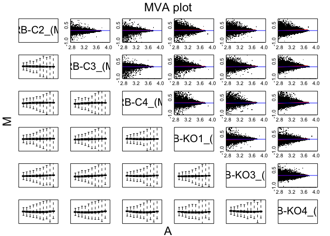
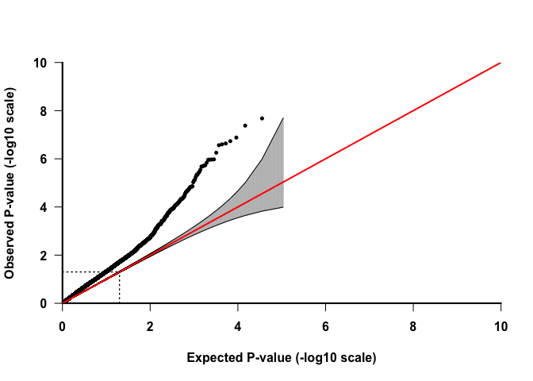
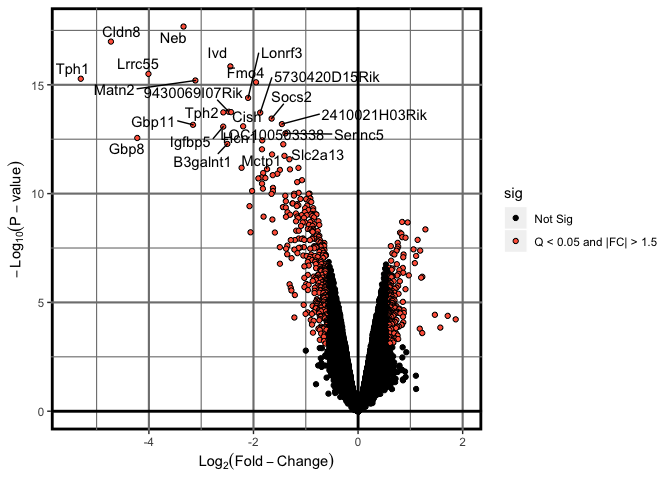
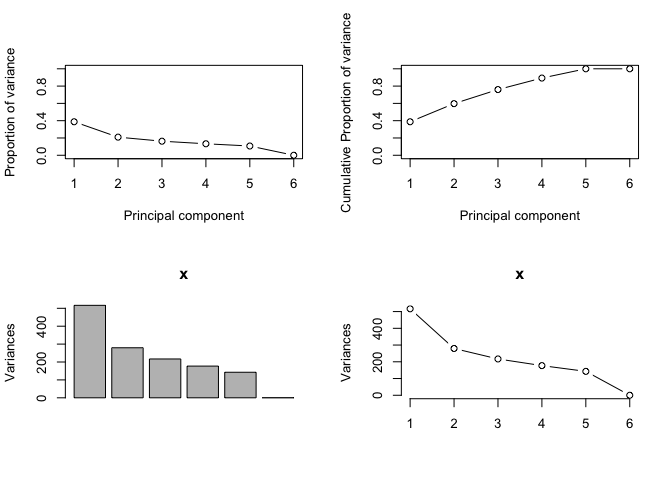
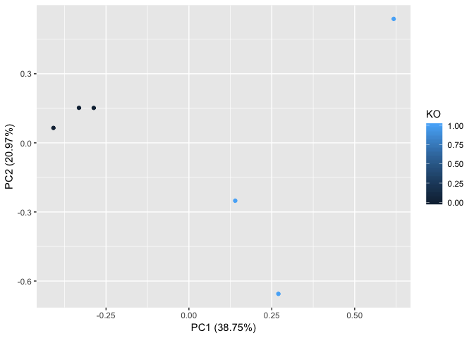
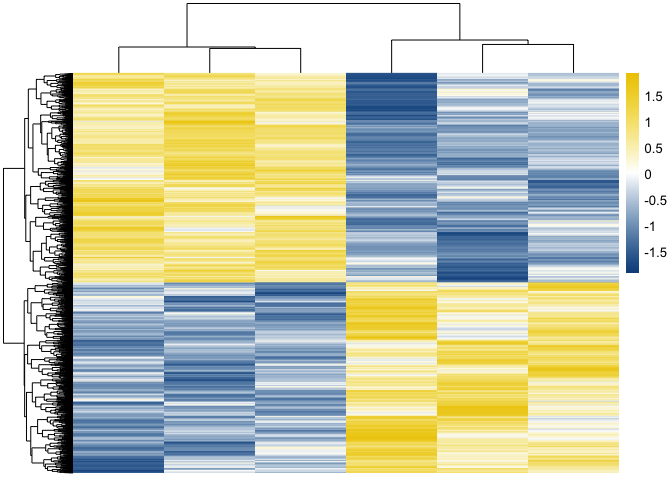
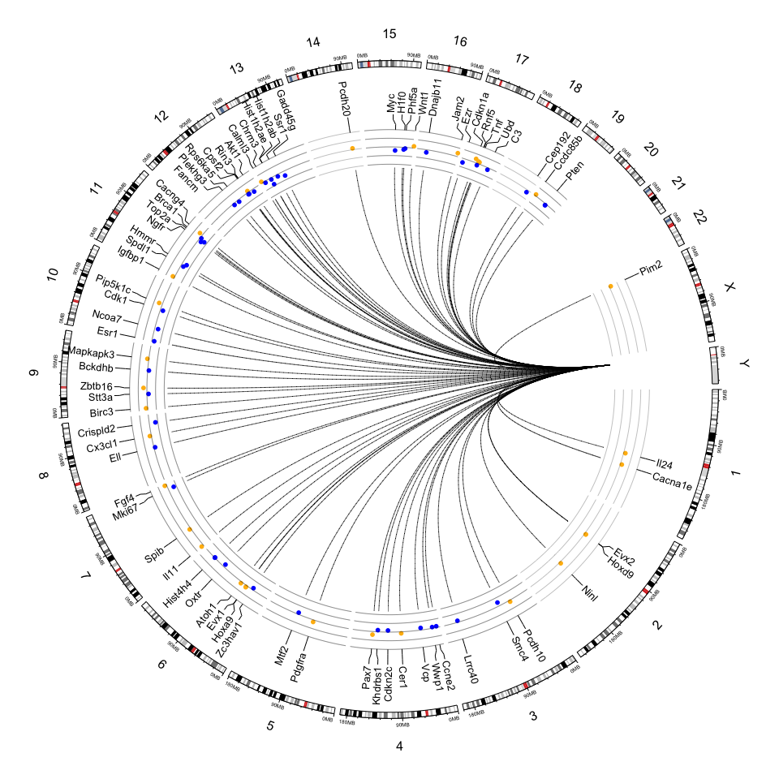
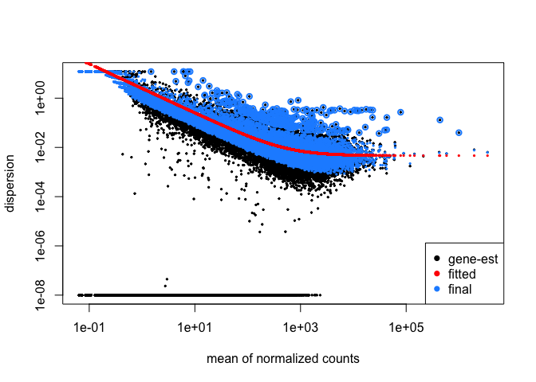
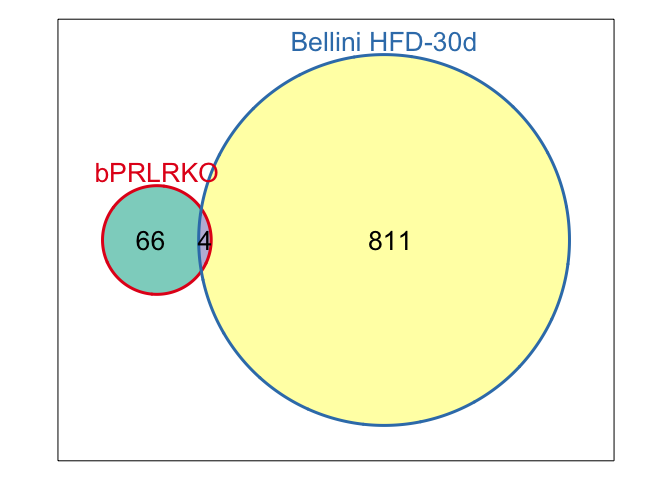

"Bioinformatics Analysis: Impact of Pregnancy-specific Prolactin Receptor Signaling on Pancreatic Islet Gene Expression in Mice"

**Author**: Mark E. Pepin
**Contact**: pepinme@uab.edu
**Institution**: University of Alabama at Birmingham  
**Location**: 542 Biomedical Research Building 2, Birmingham, AL 35294

# Microarray Pre-processing

Before differential expression could be generated, the Affymetrix array was first pre-processed for numerous quality assessments using the **aoligo** package in **r**. The raw data were first adjusted for background signal noise, as well as normalized across samples using the quantile normalization and summarization as previously described (see oligo methods).


```r
## try http:// if https:// URLs are not supported
# source("https://bioconductor.org/biocLite.R")
# biocLite("pd.mogene.2.0.st")
# biocLite("affy")
# biocLite("limma")
# biocLite("oligo")
#biocLite("mogene20sttranscriptcluster.db")
#biocLite("mogene20stprobeset.db")
##Load all required packages
library(affy)
library(limma)
library(pd.mogene.2.0.st)
library(oligo)
library(mogene20stprobeset.db)
library(mogene20sttranscriptcluster.db)
library(openxlsx)
## import "phenotype" data, describing the experimental design
celFiles <- list.celfiles('../1_Input/Microarray', full.names=TRUE)
rawData <- read.celfiles(celFiles)
```

```
## Reading in : ../1_Input/Microarray/Ronadip Banerjee_RB-C2_(MoGene-2_0-st).CEL
## Reading in : ../1_Input/Microarray/Ronadip Banerjee_RB-C3_(MoGene-2_0-st).CEL
## Reading in : ../1_Input/Microarray/Ronadip Banerjee_RB-C4_(MoGene-2_0-st).CEL
## Reading in : ../1_Input/Microarray/Ronadip Banerjee_RB-KO1_(MoGene-2_0-st).CEL
## Reading in : ../1_Input/Microarray/Ronadip Banerjee_RB-KO3_(MoGene-2_0-st).CEL
## Reading in : ../1_Input/Microarray/Ronadip Banerjee_RB-KO4_(MoGene-2_0-st).CEL
```

```r
##MA Plot
xl <- c(2.8, 4) 
yl <- c(-1, 1) 
MAplot(rawData[, 1:6], pairs=TRUE, ylim=yl, xlim=xl, plotFun=plot)
```

<!-- -->

```r
pdf(file = "../2_Output/MA.Plot_bPRLRKO.pdf", height = 4, width = 6)
MAplot(rawData[, 1:6], pairs=TRUE, ylim=yl, xlim=xl, plotFun=plot)
dev.off()
```

```
## quartz_off_screen 
##                 2
```

```r
#Background and noise subtraction, with log transformation normalization
eset<-rma(rawData)
```

```
## Background correcting
## Normalizing
## Calculating Expression
```

```r
#add sample information
Index<-read.xlsx("../1_Input/Index.xlsx", rowNames = T)
Index.fix<-AnnotatedDataFrame(Index)
phenoData(eset)<-Index.fix
#
crma=exprs(eset)
rma=format(crma, digits=5)
rma_annotated<-merge(rma, mogene20sttranscriptclusterSYMBOL, by.x = 0, by.y = 1)
rma_annotated<-merge(rma_annotated, mogene20sttranscriptclusterENTREZID, by.x = "Row.names", by.y = 1)
rma_annotated<-dplyr::rename(rma_annotated, Affy_id = Row.names, Gene.Symbol = symbol, Entrez_id=gene_id)
rownames(rma_annotated)<-rma_annotated$Affy_id
write.table(rma_annotated, file = "rma.txt", quote = FALSE, sep = "\t", row.names = FALSE, col.names = TRUE)
#generate the design matrix
design<-model.matrix(~factor(c(0, 0, 0, 1, 1, 1)))
rownames(design)<-celFiles
colnames(design)<-c("CON", "KO")
fit <- lmFit(eset, design) 
ebayes <- eBayes(fit) 
lod <- -log10(ebayes[["p.value"]][,2]) 
mtstat<- ebayes[["t"]][,2]
tab <- topTable(ebayes, coef=2, adjust="fdr", number=nrow(ebayes))
tab$Affy_id<-rownames(tab)
table<-dplyr::inner_join(tab, rma_annotated, by="Affy_id")
results<-table
results_p05<-dplyr::filter(results, P.Value<0.05)
results_q05<-dplyr::filter(results, adj.P.Val<0.05)
#Export data as tabbed excel workbook
library(openxlsx)
wb_DESeq<-createWorkbook()
#Unfiltered
  addWorksheet(wb_DESeq, "Unfiltered")
  writeData(wb_DESeq, "Unfiltered", results, startCol = 1)
#P-value Significant (0.05)
  addWorksheet(wb_DESeq, "P < 0.05")
  writeData(wb_DESeq, "P < 0.05", results_p05, startCol = 1)
#Q-value Significant (0.05)
  addWorksheet(wb_DESeq, "Q < 0.05")
  writeData(wb_DESeq, "Q < 0.05", results_q05, startCol = 1)
saveWorkbook(wb_DESeq, file = "../2_Output/bPRLR.KO_Diff.EX_Results.xlsx", overwrite = TRUE)

results_ebayes<-as.data.frame(ebayes)
results_ebayes<-merge(results_ebayes, crma, by=0)
```

\pagebreak

# Data Visualizations

## QQ Plot


```r
#Create Q-Q plot
library(Haplin)
test<-table
test<-test[complete.cases(test),]
pQQ(test$P.Value, lim=c(0,10))
```

<!-- -->

```r
pdf(file = "../2_Output/QQ.Plot_bPRLRKO.pdf", height = 4, width = 6)
pQQ(test$P.Value, lim=c(0,10))
dev.off()
```

```
## quartz_off_screen 
##                 2
```

## Volcano Plot


```r
# Load packages
library(dplyr)
library(ggplot2)
library(ggrepel)
library(openxlsx)
# Read data from the web
results<-read.xlsx("../2_Output/bPRLR.KO_Diff.EX_Results.xlsx", sheet = "Unfiltered")
results = mutate(results, sig=ifelse(results$P.Value<0.05 & abs(results$logFC)>0.585, "Q < 0.05 and |FC| > 1.5", "Not Sig"))
results = mutate(results, minuslogp=-log(P.Value))
#plot the ggplot
p = ggplot(results, aes(logFC, minuslogp)) + theme(panel.background = element_rect("white", colour = "black", size=2), panel.grid.major = element_line(colour = "gray50", size=.75), panel.grid.minor = element_line(colour = "gray50", size=0.4)) + 
geom_point(aes(fill=sig), colour="black", shape=21) + labs(x=expression(Log[2](Fold-Change)), y=expression(-Log[10](P-value))) + xlim(-5.5,2)+  geom_hline(yintercept = 0, size = 1) + geom_vline(xintercept=0, size=1)+ 
scale_fill_manual(values=c("black", "tomato"))
#add a repelling effect to the text labels.
p+geom_text_repel(data=filter(results, adj.P.Val<0.01), aes(label=Gene.Symbol))
```

<!-- -->

```r
pdf(file = "../2_Output/Volcano.Plot_bPRLRKO.pdf", height = 4, width = 6)
p+geom_text_repel(data=filter(results, adj.P.Val<0.01), aes(label=Gene.Symbol))
dev.off()
```

```
## quartz_off_screen 
##                 2
```

## Principal Components Analysis


```r
#Plot Features of the PCA
library(dplyr)
library(plotly)
##Import the data to be used for PCA
results_DEG<-dplyr::select(results, contains("Ronadip"))
results_DEG$`Ronadip.Banerjee_RB-C2_(MoGene-2_0-st).CEL`<-as.numeric(as.character(results_DEG$`Ronadip.Banerjee_RB-C2_(MoGene-2_0-st).CEL`))
results_DEG$`Ronadip.Banerjee_RB-C3_(MoGene-2_0-st).CEL`<-as.numeric(as.character(results_DEG$`Ronadip.Banerjee_RB-C3_(MoGene-2_0-st).CEL`))
results_DEG$`Ronadip.Banerjee_RB-C4_(MoGene-2_0-st).CEL`<-as.numeric(as.character(results_DEG$`Ronadip.Banerjee_RB-C4_(MoGene-2_0-st).CEL`))
results_DEG$`Ronadip.Banerjee_RB-KO1_(MoGene-2_0-st).CEL`<-as.numeric(as.character(results_DEG$`Ronadip.Banerjee_RB-KO1_(MoGene-2_0-st).CEL`))
results_DEG$`Ronadip.Banerjee_RB-KO3_(MoGene-2_0-st).CEL`<-as.numeric(as.character(results_DEG$`Ronadip.Banerjee_RB-KO3_(MoGene-2_0-st).CEL`))
results_DEG$`Ronadip.Banerjee_RB-KO4_(MoGene-2_0-st).CEL`<-as.numeric(as.character(results_DEG$`Ronadip.Banerjee_RB-KO4_(MoGene-2_0-st).CEL`))
#transpose the dataset (required for PCA)
data.pca<-t(results_DEG)
data.pca<-as.data.frame(data.pca)
##merge the file
Index<-design
rownames(Index)<-row.names(data.pca)
data.pca_Final<-merge(Index, data.pca, by=0)
rownames(data.pca_Final)<-data.pca_Final$Row.names
data.pca_Final<-dplyr::select(data.pca_Final, -Row.names)
pca.comp<-prcomp(data.pca_Final[,(ncol(Index)+1):ncol(data.pca_Final)])

pcaCharts=function(x) {
    x.var <- x$sdev ^ 2
    x.pvar <- x.var/sum(x.var)
    par(mfrow=c(2,2))
    plot(x.pvar,xlab="Principal component", 
         ylab="Proportion of variance", ylim=c(0,1), type='b')
    plot(cumsum(x.pvar),xlab="Principal component", 
         ylab="Cumulative Proportion of variance", 
         ylim=c(0,1), 
         type='b')
    screeplot(x)
    screeplot(x,type="l")
    par(mfrow=c(1,1))
}
pcaCharts(pca.comp)
```

<!-- -->

```r
write.csv(data.pca, "../2_Output/data.pca.csv")
```


```r
library(ggfortify)
library(cluster)
autoplot(pca.comp, data = data.pca_Final, colour = "KO")
```

<!-- -->

## Heatmap and Hierarchical Clustering


```r
library(pheatmap)
results_DEG<-dplyr::select(results_p05, `Ronadip Banerjee_RB-C2_(MoGene-2_0-st).CEL`:`Ronadip Banerjee_RB-KO4_(MoGene-2_0-st).CEL`)
results_DEG$`Ronadip Banerjee_RB-C2_(MoGene-2_0-st).CEL`<-as.numeric(as.character(results_DEG$`Ronadip Banerjee_RB-C2_(MoGene-2_0-st).CEL`))
results_DEG$`Ronadip Banerjee_RB-C3_(MoGene-2_0-st).CEL`<-as.numeric(as.character(results_DEG$`Ronadip Banerjee_RB-C3_(MoGene-2_0-st).CEL`))
results_DEG$`Ronadip Banerjee_RB-C4_(MoGene-2_0-st).CEL`<-as.numeric(as.character(results_DEG$`Ronadip Banerjee_RB-C4_(MoGene-2_0-st).CEL`))
results_DEG$`Ronadip Banerjee_RB-KO1_(MoGene-2_0-st).CEL`<-as.numeric(as.character(results_DEG$`Ronadip Banerjee_RB-KO1_(MoGene-2_0-st).CEL`))
results_DEG$`Ronadip Banerjee_RB-KO3_(MoGene-2_0-st).CEL`<-as.numeric(as.character(results_DEG$`Ronadip Banerjee_RB-KO3_(MoGene-2_0-st).CEL`))
results_DEG$`Ronadip Banerjee_RB-KO4_(MoGene-2_0-st).CEL`<-as.numeric(as.character(results_DEG$`Ronadip Banerjee_RB-KO4_(MoGene-2_0-st).CEL`))
##Index file for annotating samples
Annotation<-Index
rownames(Index)<-colnames(results_DEG)
paletteLength <- 100
myColor <- colorRampPalette(c("dodgerblue4", "white", "gold2"))(paletteLength)
pheatmap(results_DEG, 
         cluster_cols=T, 
         border_color=NA, 
         cluster_rows=T, 
         scale = 'row', 
         show_colnames = F, 
         show_rownames = F, 
         color = myColor)
```

<!-- -->

## Circular Genome Plot of Differentially-Expressed EZH2 Targets


```r
##Create a circular genome plot of EZH2 and its targets that are Diff. Exp'd
library(dplyr)
library(openxlsx)
#Import "Links" (the PRLR_DEGGs)
Gene_Labels<-read.xlsx("../1_Input/Circos/Links_EZH2.xlsx")
#Re-order based on chromosome name
Gene_Labels<-arrange(Gene_Labels, chromStart)
Gene_Labels$chrom<-factor(Gene_Labels$chrom, levels=c("chr1", "chr2", "chr3", "chr4", 
                                                      "chr5", "chr6", "chr7", "chr8", 
                                                      "chr9", "chr10", "chr11", "chr12", 
                                                      "chr13", "chr14", "chr15", "chr16", 
                                                      "chr17", "chr18", "chr19", "chr20", 
                                                      "chr21", "chr22", "chr23", "chrX", 
                                                      "chrY"))
Gene_Labels<-Gene_Labels[order(Gene_Labels$chrom),]
Gene_Labels<-Gene_Labels[!duplicated(Gene_Labels[,4]),]

#Read in differential expression for lines and coloring
DiffEX_raw<-read.csv("../2_Output/Diff.EQ_ebayes.limma_180315mep.csv")
rownames(DiffEX_raw)<-DiffEX_raw$X
#Filter by EZH2 Targets
EZH2_PRLR.DEGGs<-merge(Gene_Labels, DiffEX_raw, by.x="GeneSymbol", by.y = "Symbols")
EZH2_PRLR.DEGGs<-dplyr::select(EZH2_PRLR.DEGGs, chrom, chromStart, chromEnd, logFC)
# Split for coloring (up = yellow, down = blue)
EZH2_PRLR.DEGGs_UP<-filter(EZH2_PRLR.DEGGs, logFC>0)
EZH2_PRLR.DEGGs_DOWN<-filter(EZH2_PRLR.DEGGs, logFC<0)

EZH2_PRLR.DEGGs_UP<-arrange(EZH2_PRLR.DEGGs_UP, chromStart)
EZH2_PRLR.DEGGs_UP$chrom<-factor(EZH2_PRLR.DEGGs_UP$chrom, levels=c("chr1", "chr2", "chr3", "chr4", 
                                                      "chr5", "chr6", "chr7", "chr8", 
                                                      "chr9", "chr10", "chr11", "chr12", 
                                                      "chr13", "chr14", "chr15", "chr16", 
                                                      "chr17", "chr18", "chr19", "chr20", 
                                                      "chr21", "chr22", "chr23", "chrX", 
                                                      "chrY"))
EZH2_PRLR.DEGGs_UP<-EZH2_PRLR.DEGGs_UP[order(EZH2_PRLR.DEGGs_UP$chrom),]
#Fold Change DOWN (RNA)
EZH2_PRLR.DEGGs_DOWN<-arrange(EZH2_PRLR.DEGGs_DOWN, chromStart)
EZH2_PRLR.DEGGs_DOWN$chrom<-factor(EZH2_PRLR.DEGGs_DOWN$chrom, levels=c("chr1", "chr2", "chr3", "chr4", 
                                                      "chr5", "chr6", "chr7", "chr8", 
                                                      "chr9", "chr10", "chr11", "chr12", 
                                                      "chr13", "chr14", "chr15", "chr16", 
                                                      "chr17", "chr18", "chr19", "chr20", 
                                                      "chr21", "chr22", "chr23", "chrX", 
                                                      "chrY"))
EZH2_PRLR.DEGGs_DOWN<-EZH2_PRLR.DEGGs_DOWN[order(EZH2_PRLR.DEGGs_DOWN$chrom),]

##Fold Change List
Gene_FoldChange_List<-list(EZH2_PRLR.DEGGs_UP, EZH2_PRLR.DEGGs_DOWN)

library(circlize)
library(gtools)
library(dplyr)
om = circos.par("track.margin")
oc = circos.par("cell.padding")
circos.par(track.margin = c(0, 0), cell.padding = c(0, 0, 0, 0))
circos.par(start.degree = 0)
circos.initializeWithIdeogram(track.height = 0.05)
### Labels for PRLR_DEGGs
circos.genomicLabels(Gene_Labels, labels.column=4, side='outside', cex=.8)
##DEGGs
circos.genomicTrackPlotRegion(Gene_FoldChange_List, 
                              ylim = c(-4, 4), bg.border=NA,
                              panel.fun = function(region, value, ...) {
 col = ifelse(value[[1]] > 0, "darkgoldenrod1", "blue")
 circos.genomicPoints(region, value, col = col, cex = 0.8, pch = 16)
 cell.xlim = get.cell.meta.data("cell.xlim")
 for(h in c(-4, -2, 0, 2, 4)) {
   circos.lines(cell.xlim, c(h, h), col ="#00000040")
 }
}, track.height = 0.1)

circos.par(track.margin=om, cell.padding=oc)
## Add link for all DEGs with DMRs in promoter CGIs
Link_Anchor <- read.xlsx("../1_Input/Circos/Links_EZH2.xlsx", sheet = "Anchor")
Link<-Gene_Labels
Link<-dplyr::select(Gene_Labels, -GeneSymbol)
Link$chrom<-factor(Link$chrom, levels=c("chr1", "chr2", "chr3", "chr4", 
                                                      "chr5", "chr6", "chr7", "chr8", 
                                                      "chr9", "chr10", "chr11", "chr12", 
                                                      "chr13", "chr14", "chr15", "chr16", 
                                                      "chr17", "chr18", "chr19", "chr20", 
                                                      "chr21", "chr22", "chr23", "chrX", 
                                                      "chrY"))
Link<-Link[order(Link$chrom),]
Link_Anchor<-Link_Anchor[1:nrow(Link),]
circos.genomicLink(Link, Link_Anchor, col="black", lwd=0.5)
```



```r
circos.clear()
```

# Cross-Study Candidate Validation

Based on the dataset published by Schraenen et. al 2015 (PMID), we wanted to determine whether the transcriptional changes due to PRLR-knockout were impacted by pregnancy alone. To test this, we acquired the expression data from GEO, and analyzed based on the following differential-expression analysis workflow. Because C57Bl6/J mice exhibited dysglycemia at day-30 of high-fat diet treatment, we chose to examine the time-point immediately prior to onset of dysglycemia (day 10) to minimize the confounding effects of the diabetic milieu.


```
## class: DESeqDataSet 
## dim: 21382 12 
## metadata(1): version
## assays(1): counts
## rownames(21382): 0610005C13Rik 0610007C21Rik ... Zzz3 l7Rn6
## rowData names(0):
## colnames(12): 1HF141 1HF142 ... 1RC121 1RC122
## colData names(4): Sample_ID Strain Diet Duration
```

<!-- -->

```
## quartz_off_screen 
##                 2
```

```
## class: DESeqDataSet 
## dim: 21382 12 
## metadata(1): version
## assays(2): counts mu
## rownames(21382): 0610005C13Rik 0610007C21Rik ... Zzz3 l7Rn6
## rowData names(9): baseMean baseVar ... dispOutlier dispMAP
## colnames(12): 1HF141 1HF142 ... 1RC121 1RC122
## colData names(5): Sample_ID Strain Diet Duration sizeFactor
```

# Comparison of bPRLR-KO DEGs with HFD-induced DEGs

We then examined whether High-fat feeding and pregnancy employed overlapping transcriptional pathways for beta cell adaptation. Based on these results, we see a clear divergence in the transcriptional signature.


```r
library(Vennerable)
library(openxlsx)
bPRLRKO<-read.xlsx("../2_Output/bPRLR.KO_Diff.EX_Results.xlsx", sheet = "Q < 0.05")
HFD.Effect_10d<-read.xlsx("../2_Output/C57Bl6J_HFD.v.NC_10days_DESeq2.xlsx", sheet = "Q < 0.05")
HFD.Effect_30d<-read.xlsx("../2_Output/C57Bl6J_HFD.v.NC_30days_DESeq2.xlsx", sheet = "Q < 0.05")
#Create a list containing gene names for each analysis
Venn.list<-list(bPRLRKO$Gene.Symbol, HFD.Effect_30d$ensembl_gene_id)
venny<-Venn(Sets=Venn.list[1:2], SetNames = c("bPRLRKO", "Bellini HFD-30d"))
plot(venny, doWeights = T)
```

<!-- -->

# Supplemental Table: R Session Information

All packages and setting are acquired using the following command: 

```r
library(kableExtra)
sinfo<-devtools::session_info()
sinfo$platform
```

```
##  setting  value                       
##  version  R version 3.4.3 (2017-11-30)
##  os       macOS  10.14                
##  system   x86_64, darwin15.6.0        
##  ui       X11                         
##  language (EN)                        
##  collate  en_US.UTF-8                 
##  ctype    en_US.UTF-8                 
##  tz       America/Chicago             
##  date     2018-10-29
```

```r
sinfo$packages %>% kable( 
                         align="c", 
                         longtable=T, 
                         booktabs=T,
                         caption="Packages and Required Dependencies") %>% 
    kable_styling(latex_options=c("striped", "repeat_header", "condensed"))
```

<table class="table" style="margin-left: auto; margin-right: auto;">
<caption>Packages and Required Dependencies</caption>
 <thead>
  <tr>
   <th style="text-align:left;">   </th>
   <th style="text-align:center;"> package </th>
   <th style="text-align:center;"> ondiskversion </th>
   <th style="text-align:center;"> loadedversion </th>
   <th style="text-align:center;"> path </th>
   <th style="text-align:center;"> loadedpath </th>
   <th style="text-align:center;"> attached </th>
   <th style="text-align:center;"> is_base </th>
   <th style="text-align:center;"> date </th>
   <th style="text-align:center;"> source </th>
   <th style="text-align:center;"> md5ok </th>
   <th style="text-align:center;"> library </th>
  </tr>
 </thead>
<tbody>
  <tr>
   <td style="text-align:left;"> acepack </td>
   <td style="text-align:center;"> acepack </td>
   <td style="text-align:center;"> 1.4.1 </td>
   <td style="text-align:center;"> 1.4.1 </td>
   <td style="text-align:center;"> /Library/Frameworks/R.framework/Versions/3.4/Resources/library/acepack </td>
   <td style="text-align:center;"> /Library/Frameworks/R.framework/Versions/3.4/Resources/library/acepack </td>
   <td style="text-align:center;"> FALSE </td>
   <td style="text-align:center;"> FALSE </td>
   <td style="text-align:center;"> 2016-10-29 </td>
   <td style="text-align:center;"> CRAN (R 3.4.0) </td>
   <td style="text-align:center;">  </td>
   <td style="text-align:center;"> /Library/Frameworks/R.framework/Versions/3.4/Resources/library </td>
  </tr>
  <tr>
   <td style="text-align:left;"> affxparser </td>
   <td style="text-align:center;"> affxparser </td>
   <td style="text-align:center;"> 1.50.0 </td>
   <td style="text-align:center;"> 1.50.0 </td>
   <td style="text-align:center;"> /Library/Frameworks/R.framework/Versions/3.4/Resources/library/affxparser </td>
   <td style="text-align:center;"> /Library/Frameworks/R.framework/Versions/3.4/Resources/library/affxparser </td>
   <td style="text-align:center;"> FALSE </td>
   <td style="text-align:center;"> FALSE </td>
   <td style="text-align:center;"> 2017-10-31 </td>
   <td style="text-align:center;"> Bioconductor </td>
   <td style="text-align:center;">  </td>
   <td style="text-align:center;"> /Library/Frameworks/R.framework/Versions/3.4/Resources/library </td>
  </tr>
  <tr>
   <td style="text-align:left;"> affy </td>
   <td style="text-align:center;"> affy </td>
   <td style="text-align:center;"> 1.56.0 </td>
   <td style="text-align:center;"> 1.56.0 </td>
   <td style="text-align:center;"> /Library/Frameworks/R.framework/Versions/3.4/Resources/library/affy </td>
   <td style="text-align:center;"> /Library/Frameworks/R.framework/Versions/3.4/Resources/library/affy </td>
   <td style="text-align:center;"> TRUE </td>
   <td style="text-align:center;"> FALSE </td>
   <td style="text-align:center;"> 2017-10-31 </td>
   <td style="text-align:center;"> Bioconductor </td>
   <td style="text-align:center;">  </td>
   <td style="text-align:center;"> /Library/Frameworks/R.framework/Versions/3.4/Resources/library </td>
  </tr>
  <tr>
   <td style="text-align:left;"> affyio </td>
   <td style="text-align:center;"> affyio </td>
   <td style="text-align:center;"> 1.48.0 </td>
   <td style="text-align:center;"> 1.48.0 </td>
   <td style="text-align:center;"> /Library/Frameworks/R.framework/Versions/3.4/Resources/library/affyio </td>
   <td style="text-align:center;"> /Library/Frameworks/R.framework/Versions/3.4/Resources/library/affyio </td>
   <td style="text-align:center;"> FALSE </td>
   <td style="text-align:center;"> FALSE </td>
   <td style="text-align:center;"> 2017-10-31 </td>
   <td style="text-align:center;"> Bioconductor </td>
   <td style="text-align:center;">  </td>
   <td style="text-align:center;"> /Library/Frameworks/R.framework/Versions/3.4/Resources/library </td>
  </tr>
  <tr>
   <td style="text-align:left;"> annotate </td>
   <td style="text-align:center;"> annotate </td>
   <td style="text-align:center;"> 1.56.2 </td>
   <td style="text-align:center;"> 1.56.2 </td>
   <td style="text-align:center;"> /Library/Frameworks/R.framework/Versions/3.4/Resources/library/annotate </td>
   <td style="text-align:center;"> /Library/Frameworks/R.framework/Versions/3.4/Resources/library/annotate </td>
   <td style="text-align:center;"> FALSE </td>
   <td style="text-align:center;"> FALSE </td>
   <td style="text-align:center;"> 2018-03-22 </td>
   <td style="text-align:center;"> Bioconductor </td>
   <td style="text-align:center;">  </td>
   <td style="text-align:center;"> /Library/Frameworks/R.framework/Versions/3.4/Resources/library </td>
  </tr>
  <tr>
   <td style="text-align:left;"> AnnotationDbi </td>
   <td style="text-align:center;"> AnnotationDbi </td>
   <td style="text-align:center;"> 1.40.0 </td>
   <td style="text-align:center;"> 1.40.0 </td>
   <td style="text-align:center;"> /Library/Frameworks/R.framework/Versions/3.4/Resources/library/AnnotationDbi </td>
   <td style="text-align:center;"> /Library/Frameworks/R.framework/Versions/3.4/Resources/library/AnnotationDbi </td>
   <td style="text-align:center;"> TRUE </td>
   <td style="text-align:center;"> FALSE </td>
   <td style="text-align:center;"> 2017-10-31 </td>
   <td style="text-align:center;"> Bioconductor </td>
   <td style="text-align:center;">  </td>
   <td style="text-align:center;"> /Library/Frameworks/R.framework/Versions/3.4/Resources/library </td>
  </tr>
  <tr>
   <td style="text-align:left;"> assertthat </td>
   <td style="text-align:center;"> assertthat </td>
   <td style="text-align:center;"> 0.2.0 </td>
   <td style="text-align:center;"> 0.2.0 </td>
   <td style="text-align:center;"> /Library/Frameworks/R.framework/Versions/3.4/Resources/library/assertthat </td>
   <td style="text-align:center;"> /Library/Frameworks/R.framework/Versions/3.4/Resources/library/assertthat </td>
   <td style="text-align:center;"> FALSE </td>
   <td style="text-align:center;"> FALSE </td>
   <td style="text-align:center;"> 2017-04-11 </td>
   <td style="text-align:center;"> CRAN (R 3.4.0) </td>
   <td style="text-align:center;">  </td>
   <td style="text-align:center;"> /Library/Frameworks/R.framework/Versions/3.4/Resources/library </td>
  </tr>
  <tr>
   <td style="text-align:left;"> backports </td>
   <td style="text-align:center;"> backports </td>
   <td style="text-align:center;"> 1.1.2 </td>
   <td style="text-align:center;"> 1.1.2 </td>
   <td style="text-align:center;"> /Library/Frameworks/R.framework/Versions/3.4/Resources/library/backports </td>
   <td style="text-align:center;"> /Library/Frameworks/R.framework/Versions/3.4/Resources/library/backports </td>
   <td style="text-align:center;"> FALSE </td>
   <td style="text-align:center;"> FALSE </td>
   <td style="text-align:center;"> 2017-12-13 </td>
   <td style="text-align:center;"> CRAN (R 3.4.3) </td>
   <td style="text-align:center;">  </td>
   <td style="text-align:center;"> /Library/Frameworks/R.framework/Versions/3.4/Resources/library </td>
  </tr>
  <tr>
   <td style="text-align:left;"> base64enc </td>
   <td style="text-align:center;"> base64enc </td>
   <td style="text-align:center;"> 0.1.3 </td>
   <td style="text-align:center;"> 0.1-3 </td>
   <td style="text-align:center;"> /Library/Frameworks/R.framework/Versions/3.4/Resources/library/base64enc </td>
   <td style="text-align:center;"> /Library/Frameworks/R.framework/Versions/3.4/Resources/library/base64enc </td>
   <td style="text-align:center;"> FALSE </td>
   <td style="text-align:center;"> FALSE </td>
   <td style="text-align:center;"> 2015-07-28 </td>
   <td style="text-align:center;"> CRAN (R 3.4.0) </td>
   <td style="text-align:center;">  </td>
   <td style="text-align:center;"> /Library/Frameworks/R.framework/Versions/3.4/Resources/library </td>
  </tr>
  <tr>
   <td style="text-align:left;"> bindr </td>
   <td style="text-align:center;"> bindr </td>
   <td style="text-align:center;"> 0.1.1 </td>
   <td style="text-align:center;"> 0.1.1 </td>
   <td style="text-align:center;"> /Library/Frameworks/R.framework/Versions/3.4/Resources/library/bindr </td>
   <td style="text-align:center;"> /Library/Frameworks/R.framework/Versions/3.4/Resources/library/bindr </td>
   <td style="text-align:center;"> FALSE </td>
   <td style="text-align:center;"> FALSE </td>
   <td style="text-align:center;"> 2018-03-13 </td>
   <td style="text-align:center;"> CRAN (R 3.4.3) </td>
   <td style="text-align:center;">  </td>
   <td style="text-align:center;"> /Library/Frameworks/R.framework/Versions/3.4/Resources/library </td>
  </tr>
  <tr>
   <td style="text-align:left;"> bindrcpp </td>
   <td style="text-align:center;"> bindrcpp </td>
   <td style="text-align:center;"> 0.2.2 </td>
   <td style="text-align:center;"> 0.2.2 </td>
   <td style="text-align:center;"> /Library/Frameworks/R.framework/Versions/3.4/Resources/library/bindrcpp </td>
   <td style="text-align:center;"> /Library/Frameworks/R.framework/Versions/3.4/Resources/library/bindrcpp </td>
   <td style="text-align:center;"> TRUE </td>
   <td style="text-align:center;"> FALSE </td>
   <td style="text-align:center;"> 2018-03-29 </td>
   <td style="text-align:center;"> CRAN (R 3.4.3) </td>
   <td style="text-align:center;">  </td>
   <td style="text-align:center;"> /Library/Frameworks/R.framework/Versions/3.4/Resources/library </td>
  </tr>
  <tr>
   <td style="text-align:left;"> Biobase </td>
   <td style="text-align:center;"> Biobase </td>
   <td style="text-align:center;"> 2.38.0 </td>
   <td style="text-align:center;"> 2.38.0 </td>
   <td style="text-align:center;"> /Library/Frameworks/R.framework/Versions/3.4/Resources/library/Biobase </td>
   <td style="text-align:center;"> /Library/Frameworks/R.framework/Versions/3.4/Resources/library/Biobase </td>
   <td style="text-align:center;"> TRUE </td>
   <td style="text-align:center;"> FALSE </td>
   <td style="text-align:center;"> 2017-10-31 </td>
   <td style="text-align:center;"> Bioconductor </td>
   <td style="text-align:center;">  </td>
   <td style="text-align:center;"> /Library/Frameworks/R.framework/Versions/3.4/Resources/library </td>
  </tr>
  <tr>
   <td style="text-align:left;"> BiocGenerics </td>
   <td style="text-align:center;"> BiocGenerics </td>
   <td style="text-align:center;"> 0.24.0 </td>
   <td style="text-align:center;"> 0.24.0 </td>
   <td style="text-align:center;"> /Library/Frameworks/R.framework/Versions/3.4/Resources/library/BiocGenerics </td>
   <td style="text-align:center;"> /Library/Frameworks/R.framework/Versions/3.4/Resources/library/BiocGenerics </td>
   <td style="text-align:center;"> TRUE </td>
   <td style="text-align:center;"> FALSE </td>
   <td style="text-align:center;"> 2017-10-31 </td>
   <td style="text-align:center;"> Bioconductor </td>
   <td style="text-align:center;">  </td>
   <td style="text-align:center;"> /Library/Frameworks/R.framework/Versions/3.4/Resources/library </td>
  </tr>
  <tr>
   <td style="text-align:left;"> BiocInstaller </td>
   <td style="text-align:center;"> BiocInstaller </td>
   <td style="text-align:center;"> 1.28.0 </td>
   <td style="text-align:center;"> 1.28.0 </td>
   <td style="text-align:center;"> /Library/Frameworks/R.framework/Versions/3.4/Resources/library/BiocInstaller </td>
   <td style="text-align:center;"> /Library/Frameworks/R.framework/Versions/3.4/Resources/library/BiocInstaller </td>
   <td style="text-align:center;"> TRUE </td>
   <td style="text-align:center;"> FALSE </td>
   <td style="text-align:center;"> 2017-10-31 </td>
   <td style="text-align:center;"> Bioconductor </td>
   <td style="text-align:center;">  </td>
   <td style="text-align:center;"> /Library/Frameworks/R.framework/Versions/3.4/Resources/library </td>
  </tr>
  <tr>
   <td style="text-align:left;"> BiocParallel </td>
   <td style="text-align:center;"> BiocParallel </td>
   <td style="text-align:center;"> 1.12.0 </td>
   <td style="text-align:center;"> 1.12.0 </td>
   <td style="text-align:center;"> /Library/Frameworks/R.framework/Versions/3.4/Resources/library/BiocParallel </td>
   <td style="text-align:center;"> /Library/Frameworks/R.framework/Versions/3.4/Resources/library/BiocParallel </td>
   <td style="text-align:center;"> FALSE </td>
   <td style="text-align:center;"> FALSE </td>
   <td style="text-align:center;"> 2017-10-31 </td>
   <td style="text-align:center;"> Bioconductor </td>
   <td style="text-align:center;">  </td>
   <td style="text-align:center;"> /Library/Frameworks/R.framework/Versions/3.4/Resources/library </td>
  </tr>
  <tr>
   <td style="text-align:left;"> biomaRt </td>
   <td style="text-align:center;"> biomaRt </td>
   <td style="text-align:center;"> 2.34.2 </td>
   <td style="text-align:center;"> 2.34.2 </td>
   <td style="text-align:center;"> /Library/Frameworks/R.framework/Versions/3.4/Resources/library/biomaRt </td>
   <td style="text-align:center;"> /Library/Frameworks/R.framework/Versions/3.4/Resources/library/biomaRt </td>
   <td style="text-align:center;"> TRUE </td>
   <td style="text-align:center;"> FALSE </td>
   <td style="text-align:center;"> 2018-01-20 </td>
   <td style="text-align:center;"> Bioconductor </td>
   <td style="text-align:center;">  </td>
   <td style="text-align:center;"> /Library/Frameworks/R.framework/Versions/3.4/Resources/library </td>
  </tr>
  <tr>
   <td style="text-align:left;"> Biostrings </td>
   <td style="text-align:center;"> Biostrings </td>
   <td style="text-align:center;"> 2.46.0 </td>
   <td style="text-align:center;"> 2.46.0 </td>
   <td style="text-align:center;"> /Library/Frameworks/R.framework/Versions/3.4/Resources/library/Biostrings </td>
   <td style="text-align:center;"> /Library/Frameworks/R.framework/Versions/3.4/Resources/library/Biostrings </td>
   <td style="text-align:center;"> TRUE </td>
   <td style="text-align:center;"> FALSE </td>
   <td style="text-align:center;"> 2017-10-31 </td>
   <td style="text-align:center;"> Bioconductor </td>
   <td style="text-align:center;">  </td>
   <td style="text-align:center;"> /Library/Frameworks/R.framework/Versions/3.4/Resources/library </td>
  </tr>
  <tr>
   <td style="text-align:left;"> bit </td>
   <td style="text-align:center;"> bit </td>
   <td style="text-align:center;"> 1.1.14 </td>
   <td style="text-align:center;"> 1.1-14 </td>
   <td style="text-align:center;"> /Library/Frameworks/R.framework/Versions/3.4/Resources/library/bit </td>
   <td style="text-align:center;"> /Library/Frameworks/R.framework/Versions/3.4/Resources/library/bit </td>
   <td style="text-align:center;"> FALSE </td>
   <td style="text-align:center;"> FALSE </td>
   <td style="text-align:center;"> 2018-05-29 </td>
   <td style="text-align:center;"> CRAN (R 3.4.3) </td>
   <td style="text-align:center;">  </td>
   <td style="text-align:center;"> /Library/Frameworks/R.framework/Versions/3.4/Resources/library </td>
  </tr>
  <tr>
   <td style="text-align:left;"> bit64 </td>
   <td style="text-align:center;"> bit64 </td>
   <td style="text-align:center;"> 0.9.7 </td>
   <td style="text-align:center;"> 0.9-7 </td>
   <td style="text-align:center;"> /Library/Frameworks/R.framework/Versions/3.4/Resources/library/bit64 </td>
   <td style="text-align:center;"> /Library/Frameworks/R.framework/Versions/3.4/Resources/library/bit64 </td>
   <td style="text-align:center;"> FALSE </td>
   <td style="text-align:center;"> FALSE </td>
   <td style="text-align:center;"> 2017-05-08 </td>
   <td style="text-align:center;"> CRAN (R 3.4.0) </td>
   <td style="text-align:center;">  </td>
   <td style="text-align:center;"> /Library/Frameworks/R.framework/Versions/3.4/Resources/library </td>
  </tr>
  <tr>
   <td style="text-align:left;"> bitops </td>
   <td style="text-align:center;"> bitops </td>
   <td style="text-align:center;"> 1.0.6 </td>
   <td style="text-align:center;"> 1.0-6 </td>
   <td style="text-align:center;"> /Library/Frameworks/R.framework/Versions/3.4/Resources/library/bitops </td>
   <td style="text-align:center;"> /Library/Frameworks/R.framework/Versions/3.4/Resources/library/bitops </td>
   <td style="text-align:center;"> FALSE </td>
   <td style="text-align:center;"> FALSE </td>
   <td style="text-align:center;"> 2013-08-17 </td>
   <td style="text-align:center;"> CRAN (R 3.4.0) </td>
   <td style="text-align:center;">  </td>
   <td style="text-align:center;"> /Library/Frameworks/R.framework/Versions/3.4/Resources/library </td>
  </tr>
  <tr>
   <td style="text-align:left;"> blob </td>
   <td style="text-align:center;"> blob </td>
   <td style="text-align:center;"> 1.1.1 </td>
   <td style="text-align:center;"> 1.1.1 </td>
   <td style="text-align:center;"> /Library/Frameworks/R.framework/Versions/3.4/Resources/library/blob </td>
   <td style="text-align:center;"> /Library/Frameworks/R.framework/Versions/3.4/Resources/library/blob </td>
   <td style="text-align:center;"> FALSE </td>
   <td style="text-align:center;"> FALSE </td>
   <td style="text-align:center;"> 2018-03-25 </td>
   <td style="text-align:center;"> CRAN (R 3.4.4) </td>
   <td style="text-align:center;">  </td>
   <td style="text-align:center;"> /Library/Frameworks/R.framework/Versions/3.4/Resources/library </td>
  </tr>
  <tr>
   <td style="text-align:left;"> calibrate </td>
   <td style="text-align:center;"> calibrate </td>
   <td style="text-align:center;"> 1.7.2 </td>
   <td style="text-align:center;"> 1.7.2 </td>
   <td style="text-align:center;"> /Library/Frameworks/R.framework/Versions/3.4/Resources/library/calibrate </td>
   <td style="text-align:center;"> /Library/Frameworks/R.framework/Versions/3.4/Resources/library/calibrate </td>
   <td style="text-align:center;"> TRUE </td>
   <td style="text-align:center;"> FALSE </td>
   <td style="text-align:center;"> 2013-09-10 </td>
   <td style="text-align:center;"> CRAN (R 3.4.0) </td>
   <td style="text-align:center;">  </td>
   <td style="text-align:center;"> /Library/Frameworks/R.framework/Versions/3.4/Resources/library </td>
  </tr>
  <tr>
   <td style="text-align:left;"> callr </td>
   <td style="text-align:center;"> callr </td>
   <td style="text-align:center;"> 3.0.0 </td>
   <td style="text-align:center;"> 3.0.0 </td>
   <td style="text-align:center;"> /Library/Frameworks/R.framework/Versions/3.4/Resources/library/callr </td>
   <td style="text-align:center;"> /Library/Frameworks/R.framework/Versions/3.4/Resources/library/callr </td>
   <td style="text-align:center;"> FALSE </td>
   <td style="text-align:center;"> FALSE </td>
   <td style="text-align:center;"> 2018-08-24 </td>
   <td style="text-align:center;"> CRAN (R 3.4.4) </td>
   <td style="text-align:center;">  </td>
   <td style="text-align:center;"> /Library/Frameworks/R.framework/Versions/3.4/Resources/library </td>
  </tr>
  <tr>
   <td style="text-align:left;"> checkmate </td>
   <td style="text-align:center;"> checkmate </td>
   <td style="text-align:center;"> 1.8.5 </td>
   <td style="text-align:center;"> 1.8.5 </td>
   <td style="text-align:center;"> /Library/Frameworks/R.framework/Versions/3.4/Resources/library/checkmate </td>
   <td style="text-align:center;"> /Library/Frameworks/R.framework/Versions/3.4/Resources/library/checkmate </td>
   <td style="text-align:center;"> FALSE </td>
   <td style="text-align:center;"> FALSE </td>
   <td style="text-align:center;"> 2017-10-24 </td>
   <td style="text-align:center;"> CRAN (R 3.4.2) </td>
   <td style="text-align:center;">  </td>
   <td style="text-align:center;"> /Library/Frameworks/R.framework/Versions/3.4/Resources/library </td>
  </tr>
  <tr>
   <td style="text-align:left;"> circlize </td>
   <td style="text-align:center;"> circlize </td>
   <td style="text-align:center;"> 0.4.4 </td>
   <td style="text-align:center;"> 0.4.4 </td>
   <td style="text-align:center;"> /Users/pepin/Library/R/3.4/library/circlize </td>
   <td style="text-align:center;"> /Users/pepin/Library/R/3.4/library/circlize </td>
   <td style="text-align:center;"> TRUE </td>
   <td style="text-align:center;"> FALSE </td>
   <td style="text-align:center;"> 2018-06-10 </td>
   <td style="text-align:center;"> CRAN (R 3.4.4) </td>
   <td style="text-align:center;">  </td>
   <td style="text-align:center;"> /Users/pepin/Library/R/3.4/library </td>
  </tr>
  <tr>
   <td style="text-align:left;"> cli </td>
   <td style="text-align:center;"> cli </td>
   <td style="text-align:center;"> 1.0.1 </td>
   <td style="text-align:center;"> 1.0.1 </td>
   <td style="text-align:center;"> /Library/Frameworks/R.framework/Versions/3.4/Resources/library/cli </td>
   <td style="text-align:center;"> /Library/Frameworks/R.framework/Versions/3.4/Resources/library/cli </td>
   <td style="text-align:center;"> FALSE </td>
   <td style="text-align:center;"> FALSE </td>
   <td style="text-align:center;"> 2018-09-25 </td>
   <td style="text-align:center;"> CRAN (R 3.4.4) </td>
   <td style="text-align:center;">  </td>
   <td style="text-align:center;"> /Library/Frameworks/R.framework/Versions/3.4/Resources/library </td>
  </tr>
  <tr>
   <td style="text-align:left;"> cluster </td>
   <td style="text-align:center;"> cluster </td>
   <td style="text-align:center;"> 2.0.7.1 </td>
   <td style="text-align:center;"> 2.0.7-1 </td>
   <td style="text-align:center;"> /Library/Frameworks/R.framework/Versions/3.4/Resources/library/cluster </td>
   <td style="text-align:center;"> /Library/Frameworks/R.framework/Versions/3.4/Resources/library/cluster </td>
   <td style="text-align:center;"> TRUE </td>
   <td style="text-align:center;"> FALSE </td>
   <td style="text-align:center;"> 2018-04-09 </td>
   <td style="text-align:center;"> CRAN (R 3.4.4) </td>
   <td style="text-align:center;">  </td>
   <td style="text-align:center;"> /Library/Frameworks/R.framework/Versions/3.4/Resources/library </td>
  </tr>
  <tr>
   <td style="text-align:left;"> codetools </td>
   <td style="text-align:center;"> codetools </td>
   <td style="text-align:center;"> 0.2.15 </td>
   <td style="text-align:center;"> 0.2-15 </td>
   <td style="text-align:center;"> /Library/Frameworks/R.framework/Versions/3.4/Resources/library/codetools </td>
   <td style="text-align:center;"> /Library/Frameworks/R.framework/Versions/3.4/Resources/library/codetools </td>
   <td style="text-align:center;"> FALSE </td>
   <td style="text-align:center;"> FALSE </td>
   <td style="text-align:center;"> 2016-10-05 </td>
   <td style="text-align:center;"> CRAN (R 3.4.3) </td>
   <td style="text-align:center;">  </td>
   <td style="text-align:center;"> /Library/Frameworks/R.framework/Versions/3.4/Resources/library </td>
  </tr>
  <tr>
   <td style="text-align:left;"> colorspace </td>
   <td style="text-align:center;"> colorspace </td>
   <td style="text-align:center;"> 1.3.2 </td>
   <td style="text-align:center;"> 1.3-2 </td>
   <td style="text-align:center;"> /Users/pepin/Library/R/3.4/library/colorspace </td>
   <td style="text-align:center;"> /Users/pepin/Library/R/3.4/library/colorspace </td>
   <td style="text-align:center;"> FALSE </td>
   <td style="text-align:center;"> FALSE </td>
   <td style="text-align:center;"> 2016-12-14 </td>
   <td style="text-align:center;"> CRAN (R 3.4.0) </td>
   <td style="text-align:center;">  </td>
   <td style="text-align:center;"> /Users/pepin/Library/R/3.4/library </td>
  </tr>
  <tr>
   <td style="text-align:left;"> crayon </td>
   <td style="text-align:center;"> crayon </td>
   <td style="text-align:center;"> 1.3.4 </td>
   <td style="text-align:center;"> 1.3.4 </td>
   <td style="text-align:center;"> /Library/Frameworks/R.framework/Versions/3.4/Resources/library/crayon </td>
   <td style="text-align:center;"> /Library/Frameworks/R.framework/Versions/3.4/Resources/library/crayon </td>
   <td style="text-align:center;"> FALSE </td>
   <td style="text-align:center;"> FALSE </td>
   <td style="text-align:center;"> 2017-09-16 </td>
   <td style="text-align:center;"> CRAN (R 3.4.1) </td>
   <td style="text-align:center;">  </td>
   <td style="text-align:center;"> /Library/Frameworks/R.framework/Versions/3.4/Resources/library </td>
  </tr>
  <tr>
   <td style="text-align:left;"> data.table </td>
   <td style="text-align:center;"> data.table </td>
   <td style="text-align:center;"> 1.11.8 </td>
   <td style="text-align:center;"> 1.11.8 </td>
   <td style="text-align:center;"> /Users/pepin/Library/R/3.4/library/data.table </td>
   <td style="text-align:center;"> /Users/pepin/Library/R/3.4/library/data.table </td>
   <td style="text-align:center;"> TRUE </td>
   <td style="text-align:center;"> FALSE </td>
   <td style="text-align:center;"> 2018-09-30 </td>
   <td style="text-align:center;"> CRAN (R 3.4.4) </td>
   <td style="text-align:center;">  </td>
   <td style="text-align:center;"> /Users/pepin/Library/R/3.4/library </td>
  </tr>
  <tr>
   <td style="text-align:left;"> DBI </td>
   <td style="text-align:center;"> DBI </td>
   <td style="text-align:center;"> 1.0.0 </td>
   <td style="text-align:center;"> 1.0.0 </td>
   <td style="text-align:center;"> /Library/Frameworks/R.framework/Versions/3.4/Resources/library/DBI </td>
   <td style="text-align:center;"> /Library/Frameworks/R.framework/Versions/3.4/Resources/library/DBI </td>
   <td style="text-align:center;"> TRUE </td>
   <td style="text-align:center;"> FALSE </td>
   <td style="text-align:center;"> 2018-05-02 </td>
   <td style="text-align:center;"> CRAN (R 3.4.3) </td>
   <td style="text-align:center;">  </td>
   <td style="text-align:center;"> /Library/Frameworks/R.framework/Versions/3.4/Resources/library </td>
  </tr>
  <tr>
   <td style="text-align:left;"> debugme </td>
   <td style="text-align:center;"> debugme </td>
   <td style="text-align:center;"> 1.1.0 </td>
   <td style="text-align:center;"> 1.1.0 </td>
   <td style="text-align:center;"> /Library/Frameworks/R.framework/Versions/3.4/Resources/library/debugme </td>
   <td style="text-align:center;"> /Library/Frameworks/R.framework/Versions/3.4/Resources/library/debugme </td>
   <td style="text-align:center;"> FALSE </td>
   <td style="text-align:center;"> FALSE </td>
   <td style="text-align:center;"> 2017-10-22 </td>
   <td style="text-align:center;"> CRAN (R 3.4.2) </td>
   <td style="text-align:center;">  </td>
   <td style="text-align:center;"> /Library/Frameworks/R.framework/Versions/3.4/Resources/library </td>
  </tr>
  <tr>
   <td style="text-align:left;"> DelayedArray </td>
   <td style="text-align:center;"> DelayedArray </td>
   <td style="text-align:center;"> 0.4.1 </td>
   <td style="text-align:center;"> 0.4.1 </td>
   <td style="text-align:center;"> /Library/Frameworks/R.framework/Versions/3.4/Resources/library/DelayedArray </td>
   <td style="text-align:center;"> /Library/Frameworks/R.framework/Versions/3.4/Resources/library/DelayedArray </td>
   <td style="text-align:center;"> TRUE </td>
   <td style="text-align:center;"> FALSE </td>
   <td style="text-align:center;"> 2017-11-07 </td>
   <td style="text-align:center;"> Bioconductor </td>
   <td style="text-align:center;">  </td>
   <td style="text-align:center;"> /Library/Frameworks/R.framework/Versions/3.4/Resources/library </td>
  </tr>
  <tr>
   <td style="text-align:left;"> desc </td>
   <td style="text-align:center;"> desc </td>
   <td style="text-align:center;"> 1.2.0 </td>
   <td style="text-align:center;"> 1.2.0 </td>
   <td style="text-align:center;"> /Users/pepin/Library/R/3.4/library/desc </td>
   <td style="text-align:center;"> /Users/pepin/Library/R/3.4/library/desc </td>
   <td style="text-align:center;"> FALSE </td>
   <td style="text-align:center;"> FALSE </td>
   <td style="text-align:center;"> 2018-05-01 </td>
   <td style="text-align:center;"> CRAN (R 3.4.4) </td>
   <td style="text-align:center;">  </td>
   <td style="text-align:center;"> /Users/pepin/Library/R/3.4/library </td>
  </tr>
  <tr>
   <td style="text-align:left;"> DESeq2 </td>
   <td style="text-align:center;"> DESeq2 </td>
   <td style="text-align:center;"> 1.18.1 </td>
   <td style="text-align:center;"> 1.18.1 </td>
   <td style="text-align:center;"> /Users/pepin/Library/R/3.4/library/DESeq2 </td>
   <td style="text-align:center;"> /Users/pepin/Library/R/3.4/library/DESeq2 </td>
   <td style="text-align:center;"> TRUE </td>
   <td style="text-align:center;"> FALSE </td>
   <td style="text-align:center;"> 2017-11-12 </td>
   <td style="text-align:center;"> Bioconductor </td>
   <td style="text-align:center;">  </td>
   <td style="text-align:center;"> /Users/pepin/Library/R/3.4/library </td>
  </tr>
  <tr>
   <td style="text-align:left;"> devtools </td>
   <td style="text-align:center;"> devtools </td>
   <td style="text-align:center;"> 2.0.0 </td>
   <td style="text-align:center;"> 2.0.0 </td>
   <td style="text-align:center;"> /Users/pepin/Library/R/3.4/library/devtools </td>
   <td style="text-align:center;"> /Users/pepin/Library/R/3.4/library/devtools </td>
   <td style="text-align:center;"> FALSE </td>
   <td style="text-align:center;"> FALSE </td>
   <td style="text-align:center;"> 2018-10-19 </td>
   <td style="text-align:center;"> CRAN (R 3.4.3) </td>
   <td style="text-align:center;">  </td>
   <td style="text-align:center;"> /Users/pepin/Library/R/3.4/library </td>
  </tr>
  <tr>
   <td style="text-align:left;"> digest </td>
   <td style="text-align:center;"> digest </td>
   <td style="text-align:center;"> 0.6.18 </td>
   <td style="text-align:center;"> 0.6.18 </td>
   <td style="text-align:center;"> /Library/Frameworks/R.framework/Versions/3.4/Resources/library/digest </td>
   <td style="text-align:center;"> /Library/Frameworks/R.framework/Versions/3.4/Resources/library/digest </td>
   <td style="text-align:center;"> FALSE </td>
   <td style="text-align:center;"> FALSE </td>
   <td style="text-align:center;"> 2018-10-10 </td>
   <td style="text-align:center;"> CRAN (R 3.4.4) </td>
   <td style="text-align:center;">  </td>
   <td style="text-align:center;"> /Library/Frameworks/R.framework/Versions/3.4/Resources/library </td>
  </tr>
  <tr>
   <td style="text-align:left;"> dplyr </td>
   <td style="text-align:center;"> dplyr </td>
   <td style="text-align:center;"> 0.7.7 </td>
   <td style="text-align:center;"> 0.7.7 </td>
   <td style="text-align:center;"> /Library/Frameworks/R.framework/Versions/3.4/Resources/library/dplyr </td>
   <td style="text-align:center;"> /Library/Frameworks/R.framework/Versions/3.4/Resources/library/dplyr </td>
   <td style="text-align:center;"> TRUE </td>
   <td style="text-align:center;"> FALSE </td>
   <td style="text-align:center;"> 2018-10-16 </td>
   <td style="text-align:center;"> CRAN (R 3.4.4) </td>
   <td style="text-align:center;">  </td>
   <td style="text-align:center;"> /Library/Frameworks/R.framework/Versions/3.4/Resources/library </td>
  </tr>
  <tr>
   <td style="text-align:left;"> evaluate </td>
   <td style="text-align:center;"> evaluate </td>
   <td style="text-align:center;"> 0.12 </td>
   <td style="text-align:center;"> 0.12 </td>
   <td style="text-align:center;"> /Library/Frameworks/R.framework/Versions/3.4/Resources/library/evaluate </td>
   <td style="text-align:center;"> /Library/Frameworks/R.framework/Versions/3.4/Resources/library/evaluate </td>
   <td style="text-align:center;"> FALSE </td>
   <td style="text-align:center;"> FALSE </td>
   <td style="text-align:center;"> 2018-10-09 </td>
   <td style="text-align:center;"> CRAN (R 3.4.4) </td>
   <td style="text-align:center;">  </td>
   <td style="text-align:center;"> /Library/Frameworks/R.framework/Versions/3.4/Resources/library </td>
  </tr>
  <tr>
   <td style="text-align:left;"> fastmatch </td>
   <td style="text-align:center;"> fastmatch </td>
   <td style="text-align:center;"> 1.1.0 </td>
   <td style="text-align:center;"> 1.1-0 </td>
   <td style="text-align:center;"> /Library/Frameworks/R.framework/Versions/3.4/Resources/library/fastmatch </td>
   <td style="text-align:center;"> /Library/Frameworks/R.framework/Versions/3.4/Resources/library/fastmatch </td>
   <td style="text-align:center;"> FALSE </td>
   <td style="text-align:center;"> FALSE </td>
   <td style="text-align:center;"> 2017-01-28 </td>
   <td style="text-align:center;"> CRAN (R 3.4.0) </td>
   <td style="text-align:center;">  </td>
   <td style="text-align:center;"> /Library/Frameworks/R.framework/Versions/3.4/Resources/library </td>
  </tr>
  <tr>
   <td style="text-align:left;"> ff </td>
   <td style="text-align:center;"> ff </td>
   <td style="text-align:center;"> 2.2.14 </td>
   <td style="text-align:center;"> 2.2-14 </td>
   <td style="text-align:center;"> /Library/Frameworks/R.framework/Versions/3.4/Resources/library/ff </td>
   <td style="text-align:center;"> /Library/Frameworks/R.framework/Versions/3.4/Resources/library/ff </td>
   <td style="text-align:center;"> FALSE </td>
   <td style="text-align:center;"> FALSE </td>
   <td style="text-align:center;"> 2018-05-15 </td>
   <td style="text-align:center;"> CRAN (R 3.4.3) </td>
   <td style="text-align:center;">  </td>
   <td style="text-align:center;"> /Library/Frameworks/R.framework/Versions/3.4/Resources/library </td>
  </tr>
  <tr>
   <td style="text-align:left;"> ffbase </td>
   <td style="text-align:center;"> ffbase </td>
   <td style="text-align:center;"> 0.12.5 </td>
   <td style="text-align:center;"> 0.12.5 </td>
   <td style="text-align:center;"> /Library/Frameworks/R.framework/Versions/3.4/Resources/library/ffbase </td>
   <td style="text-align:center;"> /Library/Frameworks/R.framework/Versions/3.4/Resources/library/ffbase </td>
   <td style="text-align:center;"> FALSE </td>
   <td style="text-align:center;"> FALSE </td>
   <td style="text-align:center;"> 2018-09-24 </td>
   <td style="text-align:center;"> CRAN (R 3.4.4) </td>
   <td style="text-align:center;">  </td>
   <td style="text-align:center;"> /Library/Frameworks/R.framework/Versions/3.4/Resources/library </td>
  </tr>
  <tr>
   <td style="text-align:left;"> foreach </td>
   <td style="text-align:center;"> foreach </td>
   <td style="text-align:center;"> 1.4.4 </td>
   <td style="text-align:center;"> 1.4.4 </td>
   <td style="text-align:center;"> /Library/Frameworks/R.framework/Versions/3.4/Resources/library/foreach </td>
   <td style="text-align:center;"> /Library/Frameworks/R.framework/Versions/3.4/Resources/library/foreach </td>
   <td style="text-align:center;"> FALSE </td>
   <td style="text-align:center;"> FALSE </td>
   <td style="text-align:center;"> 2017-12-12 </td>
   <td style="text-align:center;"> CRAN (R 3.4.3) </td>
   <td style="text-align:center;">  </td>
   <td style="text-align:center;"> /Library/Frameworks/R.framework/Versions/3.4/Resources/library </td>
  </tr>
  <tr>
   <td style="text-align:left;"> foreign </td>
   <td style="text-align:center;"> foreign </td>
   <td style="text-align:center;"> 0.8.71 </td>
   <td style="text-align:center;"> 0.8-71 </td>
   <td style="text-align:center;"> /Library/Frameworks/R.framework/Versions/3.4/Resources/library/foreign </td>
   <td style="text-align:center;"> /Library/Frameworks/R.framework/Versions/3.4/Resources/library/foreign </td>
   <td style="text-align:center;"> FALSE </td>
   <td style="text-align:center;"> FALSE </td>
   <td style="text-align:center;"> 2018-07-20 </td>
   <td style="text-align:center;"> CRAN (R 3.4.4) </td>
   <td style="text-align:center;">  </td>
   <td style="text-align:center;"> /Library/Frameworks/R.framework/Versions/3.4/Resources/library </td>
  </tr>
  <tr>
   <td style="text-align:left;"> Formula </td>
   <td style="text-align:center;"> Formula </td>
   <td style="text-align:center;"> 1.2.3 </td>
   <td style="text-align:center;"> 1.2-3 </td>
   <td style="text-align:center;"> /Library/Frameworks/R.framework/Versions/3.4/Resources/library/Formula </td>
   <td style="text-align:center;"> /Library/Frameworks/R.framework/Versions/3.4/Resources/library/Formula </td>
   <td style="text-align:center;"> FALSE </td>
   <td style="text-align:center;"> FALSE </td>
   <td style="text-align:center;"> 2018-05-03 </td>
   <td style="text-align:center;"> CRAN (R 3.4.3) </td>
   <td style="text-align:center;">  </td>
   <td style="text-align:center;"> /Library/Frameworks/R.framework/Versions/3.4/Resources/library </td>
  </tr>
  <tr>
   <td style="text-align:left;"> fs </td>
   <td style="text-align:center;"> fs </td>
   <td style="text-align:center;"> 1.2.6 </td>
   <td style="text-align:center;"> 1.2.6 </td>
   <td style="text-align:center;"> /Library/Frameworks/R.framework/Versions/3.4/Resources/library/fs </td>
   <td style="text-align:center;"> /Library/Frameworks/R.framework/Versions/3.4/Resources/library/fs </td>
   <td style="text-align:center;"> FALSE </td>
   <td style="text-align:center;"> FALSE </td>
   <td style="text-align:center;"> 2018-08-23 </td>
   <td style="text-align:center;"> CRAN (R 3.4.4) </td>
   <td style="text-align:center;">  </td>
   <td style="text-align:center;"> /Library/Frameworks/R.framework/Versions/3.4/Resources/library </td>
  </tr>
  <tr>
   <td style="text-align:left;"> genefilter </td>
   <td style="text-align:center;"> genefilter </td>
   <td style="text-align:center;"> 1.60.0 </td>
   <td style="text-align:center;"> 1.60.0 </td>
   <td style="text-align:center;"> /Library/Frameworks/R.framework/Versions/3.4/Resources/library/genefilter </td>
   <td style="text-align:center;"> /Library/Frameworks/R.framework/Versions/3.4/Resources/library/genefilter </td>
   <td style="text-align:center;"> FALSE </td>
   <td style="text-align:center;"> FALSE </td>
   <td style="text-align:center;"> 2017-10-31 </td>
   <td style="text-align:center;"> Bioconductor </td>
   <td style="text-align:center;">  </td>
   <td style="text-align:center;"> /Library/Frameworks/R.framework/Versions/3.4/Resources/library </td>
  </tr>
  <tr>
   <td style="text-align:left;"> geneplotter </td>
   <td style="text-align:center;"> geneplotter </td>
   <td style="text-align:center;"> 1.56.0 </td>
   <td style="text-align:center;"> 1.56.0 </td>
   <td style="text-align:center;"> /Library/Frameworks/R.framework/Versions/3.4/Resources/library/geneplotter </td>
   <td style="text-align:center;"> /Library/Frameworks/R.framework/Versions/3.4/Resources/library/geneplotter </td>
   <td style="text-align:center;"> FALSE </td>
   <td style="text-align:center;"> FALSE </td>
   <td style="text-align:center;"> 2017-10-31 </td>
   <td style="text-align:center;"> Bioconductor </td>
   <td style="text-align:center;">  </td>
   <td style="text-align:center;"> /Library/Frameworks/R.framework/Versions/3.4/Resources/library </td>
  </tr>
  <tr>
   <td style="text-align:left;"> GenomeInfoDb </td>
   <td style="text-align:center;"> GenomeInfoDb </td>
   <td style="text-align:center;"> 1.14.0 </td>
   <td style="text-align:center;"> 1.14.0 </td>
   <td style="text-align:center;"> /Library/Frameworks/R.framework/Versions/3.4/Resources/library/GenomeInfoDb </td>
   <td style="text-align:center;"> /Library/Frameworks/R.framework/Versions/3.4/Resources/library/GenomeInfoDb </td>
   <td style="text-align:center;"> TRUE </td>
   <td style="text-align:center;"> FALSE </td>
   <td style="text-align:center;"> 2017-10-31 </td>
   <td style="text-align:center;"> Bioconductor </td>
   <td style="text-align:center;">  </td>
   <td style="text-align:center;"> /Library/Frameworks/R.framework/Versions/3.4/Resources/library </td>
  </tr>
  <tr>
   <td style="text-align:left;"> GenomeInfoDbData </td>
   <td style="text-align:center;"> GenomeInfoDbData </td>
   <td style="text-align:center;"> 1.0.0 </td>
   <td style="text-align:center;"> 1.0.0 </td>
   <td style="text-align:center;"> /Library/Frameworks/R.framework/Versions/3.4/Resources/library/GenomeInfoDbData </td>
   <td style="text-align:center;"> /Library/Frameworks/R.framework/Versions/3.4/Resources/library/GenomeInfoDbData </td>
   <td style="text-align:center;"> FALSE </td>
   <td style="text-align:center;"> FALSE </td>
   <td style="text-align:center;"> 2018-02-16 </td>
   <td style="text-align:center;"> Bioconductor </td>
   <td style="text-align:center;">  </td>
   <td style="text-align:center;"> /Library/Frameworks/R.framework/Versions/3.4/Resources/library </td>
  </tr>
  <tr>
   <td style="text-align:left;"> GenomicRanges </td>
   <td style="text-align:center;"> GenomicRanges </td>
   <td style="text-align:center;"> 1.30.3 </td>
   <td style="text-align:center;"> 1.30.3 </td>
   <td style="text-align:center;"> /Users/pepin/Library/R/3.4/library/GenomicRanges </td>
   <td style="text-align:center;"> /Users/pepin/Library/R/3.4/library/GenomicRanges </td>
   <td style="text-align:center;"> TRUE </td>
   <td style="text-align:center;"> FALSE </td>
   <td style="text-align:center;"> 2018-02-26 </td>
   <td style="text-align:center;"> Bioconductor </td>
   <td style="text-align:center;">  </td>
   <td style="text-align:center;"> /Users/pepin/Library/R/3.4/library </td>
  </tr>
  <tr>
   <td style="text-align:left;"> ggfortify </td>
   <td style="text-align:center;"> ggfortify </td>
   <td style="text-align:center;"> 0.4.5 </td>
   <td style="text-align:center;"> 0.4.5 </td>
   <td style="text-align:center;"> /Library/Frameworks/R.framework/Versions/3.4/Resources/library/ggfortify </td>
   <td style="text-align:center;"> /Library/Frameworks/R.framework/Versions/3.4/Resources/library/ggfortify </td>
   <td style="text-align:center;"> TRUE </td>
   <td style="text-align:center;"> FALSE </td>
   <td style="text-align:center;"> 2018-05-26 </td>
   <td style="text-align:center;"> CRAN (R 3.4.3) </td>
   <td style="text-align:center;">  </td>
   <td style="text-align:center;"> /Library/Frameworks/R.framework/Versions/3.4/Resources/library </td>
  </tr>
  <tr>
   <td style="text-align:left;"> ggplot2 </td>
   <td style="text-align:center;"> ggplot2 </td>
   <td style="text-align:center;"> 3.1.0 </td>
   <td style="text-align:center;"> 3.1.0 </td>
   <td style="text-align:center;"> /Library/Frameworks/R.framework/Versions/3.4/Resources/library/ggplot2 </td>
   <td style="text-align:center;"> /Library/Frameworks/R.framework/Versions/3.4/Resources/library/ggplot2 </td>
   <td style="text-align:center;"> TRUE </td>
   <td style="text-align:center;"> FALSE </td>
   <td style="text-align:center;"> 2018-10-25 </td>
   <td style="text-align:center;"> CRAN (R 3.4.3) </td>
   <td style="text-align:center;">  </td>
   <td style="text-align:center;"> /Library/Frameworks/R.framework/Versions/3.4/Resources/library </td>
  </tr>
  <tr>
   <td style="text-align:left;"> ggrepel </td>
   <td style="text-align:center;"> ggrepel </td>
   <td style="text-align:center;"> 0.8.0 </td>
   <td style="text-align:center;"> 0.8.0 </td>
   <td style="text-align:center;"> /Users/pepin/Library/R/3.4/library/ggrepel </td>
   <td style="text-align:center;"> /Users/pepin/Library/R/3.4/library/ggrepel </td>
   <td style="text-align:center;"> TRUE </td>
   <td style="text-align:center;"> FALSE </td>
   <td style="text-align:center;"> 2018-05-09 </td>
   <td style="text-align:center;"> CRAN (R 3.4.4) </td>
   <td style="text-align:center;">  </td>
   <td style="text-align:center;"> /Users/pepin/Library/R/3.4/library </td>
  </tr>
  <tr>
   <td style="text-align:left;"> GlobalOptions </td>
   <td style="text-align:center;"> GlobalOptions </td>
   <td style="text-align:center;"> 0.1.0 </td>
   <td style="text-align:center;"> 0.1.0 </td>
   <td style="text-align:center;"> /Users/pepin/Library/R/3.4/library/GlobalOptions </td>
   <td style="text-align:center;"> /Users/pepin/Library/R/3.4/library/GlobalOptions </td>
   <td style="text-align:center;"> FALSE </td>
   <td style="text-align:center;"> FALSE </td>
   <td style="text-align:center;"> 2018-06-09 </td>
   <td style="text-align:center;"> CRAN (R 3.4.4) </td>
   <td style="text-align:center;">  </td>
   <td style="text-align:center;"> /Users/pepin/Library/R/3.4/library </td>
  </tr>
  <tr>
   <td style="text-align:left;"> glue </td>
   <td style="text-align:center;"> glue </td>
   <td style="text-align:center;"> 1.3.0 </td>
   <td style="text-align:center;"> 1.3.0 </td>
   <td style="text-align:center;"> /Library/Frameworks/R.framework/Versions/3.4/Resources/library/glue </td>
   <td style="text-align:center;"> /Library/Frameworks/R.framework/Versions/3.4/Resources/library/glue </td>
   <td style="text-align:center;"> FALSE </td>
   <td style="text-align:center;"> FALSE </td>
   <td style="text-align:center;"> 2018-07-17 </td>
   <td style="text-align:center;"> CRAN (R 3.4.4) </td>
   <td style="text-align:center;">  </td>
   <td style="text-align:center;"> /Library/Frameworks/R.framework/Versions/3.4/Resources/library </td>
  </tr>
  <tr>
   <td style="text-align:left;"> graph </td>
   <td style="text-align:center;"> graph </td>
   <td style="text-align:center;"> 1.56.0 </td>
   <td style="text-align:center;"> 1.56.0 </td>
   <td style="text-align:center;"> /Users/pepin/Library/R/3.4/library/graph </td>
   <td style="text-align:center;"> /Users/pepin/Library/R/3.4/library/graph </td>
   <td style="text-align:center;"> TRUE </td>
   <td style="text-align:center;"> FALSE </td>
   <td style="text-align:center;"> 2017-10-31 </td>
   <td style="text-align:center;"> Bioconductor </td>
   <td style="text-align:center;">  </td>
   <td style="text-align:center;"> /Users/pepin/Library/R/3.4/library </td>
  </tr>
  <tr>
   <td style="text-align:left;"> gridExtra </td>
   <td style="text-align:center;"> gridExtra </td>
   <td style="text-align:center;"> 2.3 </td>
   <td style="text-align:center;"> 2.3 </td>
   <td style="text-align:center;"> /Library/Frameworks/R.framework/Versions/3.4/Resources/library/gridExtra </td>
   <td style="text-align:center;"> /Library/Frameworks/R.framework/Versions/3.4/Resources/library/gridExtra </td>
   <td style="text-align:center;"> FALSE </td>
   <td style="text-align:center;"> FALSE </td>
   <td style="text-align:center;"> 2017-09-09 </td>
   <td style="text-align:center;"> CRAN (R 3.4.1) </td>
   <td style="text-align:center;">  </td>
   <td style="text-align:center;"> /Library/Frameworks/R.framework/Versions/3.4/Resources/library </td>
  </tr>
  <tr>
   <td style="text-align:left;"> gtable </td>
   <td style="text-align:center;"> gtable </td>
   <td style="text-align:center;"> 0.2.0 </td>
   <td style="text-align:center;"> 0.2.0 </td>
   <td style="text-align:center;"> /Library/Frameworks/R.framework/Versions/3.4/Resources/library/gtable </td>
   <td style="text-align:center;"> /Library/Frameworks/R.framework/Versions/3.4/Resources/library/gtable </td>
   <td style="text-align:center;"> FALSE </td>
   <td style="text-align:center;"> FALSE </td>
   <td style="text-align:center;"> 2016-02-26 </td>
   <td style="text-align:center;"> CRAN (R 3.4.0) </td>
   <td style="text-align:center;">  </td>
   <td style="text-align:center;"> /Library/Frameworks/R.framework/Versions/3.4/Resources/library </td>
  </tr>
  <tr>
   <td style="text-align:left;"> gtools </td>
   <td style="text-align:center;"> gtools </td>
   <td style="text-align:center;"> 3.8.1 </td>
   <td style="text-align:center;"> 3.8.1 </td>
   <td style="text-align:center;"> /Library/Frameworks/R.framework/Versions/3.4/Resources/library/gtools </td>
   <td style="text-align:center;"> /Library/Frameworks/R.framework/Versions/3.4/Resources/library/gtools </td>
   <td style="text-align:center;"> TRUE </td>
   <td style="text-align:center;"> FALSE </td>
   <td style="text-align:center;"> 2018-06-26 </td>
   <td style="text-align:center;"> CRAN (R 3.4.4) </td>
   <td style="text-align:center;">  </td>
   <td style="text-align:center;"> /Library/Frameworks/R.framework/Versions/3.4/Resources/library </td>
  </tr>
  <tr>
   <td style="text-align:left;"> Haplin </td>
   <td style="text-align:center;"> Haplin </td>
   <td style="text-align:center;"> 7.0.0 </td>
   <td style="text-align:center;"> 7.0.0 </td>
   <td style="text-align:center;"> /Library/Frameworks/R.framework/Versions/3.4/Resources/library/Haplin </td>
   <td style="text-align:center;"> /Library/Frameworks/R.framework/Versions/3.4/Resources/library/Haplin </td>
   <td style="text-align:center;"> TRUE </td>
   <td style="text-align:center;"> FALSE </td>
   <td style="text-align:center;"> 2018-05-27 </td>
   <td style="text-align:center;"> CRAN (R 3.4.3) </td>
   <td style="text-align:center;">  </td>
   <td style="text-align:center;"> /Library/Frameworks/R.framework/Versions/3.4/Resources/library </td>
  </tr>
  <tr>
   <td style="text-align:left;"> highr </td>
   <td style="text-align:center;"> highr </td>
   <td style="text-align:center;"> 0.7 </td>
   <td style="text-align:center;"> 0.7 </td>
   <td style="text-align:center;"> /Library/Frameworks/R.framework/Versions/3.4/Resources/library/highr </td>
   <td style="text-align:center;"> /Library/Frameworks/R.framework/Versions/3.4/Resources/library/highr </td>
   <td style="text-align:center;"> FALSE </td>
   <td style="text-align:center;"> FALSE </td>
   <td style="text-align:center;"> 2018-06-09 </td>
   <td style="text-align:center;"> CRAN (R 3.4.4) </td>
   <td style="text-align:center;">  </td>
   <td style="text-align:center;"> /Library/Frameworks/R.framework/Versions/3.4/Resources/library </td>
  </tr>
  <tr>
   <td style="text-align:left;"> Hmisc </td>
   <td style="text-align:center;"> Hmisc </td>
   <td style="text-align:center;"> 4.1.1 </td>
   <td style="text-align:center;"> 4.1-1 </td>
   <td style="text-align:center;"> /Library/Frameworks/R.framework/Versions/3.4/Resources/library/Hmisc </td>
   <td style="text-align:center;"> /Library/Frameworks/R.framework/Versions/3.4/Resources/library/Hmisc </td>
   <td style="text-align:center;"> FALSE </td>
   <td style="text-align:center;"> FALSE </td>
   <td style="text-align:center;"> 2018-01-03 </td>
   <td style="text-align:center;"> CRAN (R 3.4.3) </td>
   <td style="text-align:center;">  </td>
   <td style="text-align:center;"> /Library/Frameworks/R.framework/Versions/3.4/Resources/library </td>
  </tr>
  <tr>
   <td style="text-align:left;"> hms </td>
   <td style="text-align:center;"> hms </td>
   <td style="text-align:center;"> 0.4.2 </td>
   <td style="text-align:center;"> 0.4.2 </td>
   <td style="text-align:center;"> /Library/Frameworks/R.framework/Versions/3.4/Resources/library/hms </td>
   <td style="text-align:center;"> /Library/Frameworks/R.framework/Versions/3.4/Resources/library/hms </td>
   <td style="text-align:center;"> FALSE </td>
   <td style="text-align:center;"> FALSE </td>
   <td style="text-align:center;"> 2018-03-10 </td>
   <td style="text-align:center;"> CRAN (R 3.4.3) </td>
   <td style="text-align:center;">  </td>
   <td style="text-align:center;"> /Library/Frameworks/R.framework/Versions/3.4/Resources/library </td>
  </tr>
  <tr>
   <td style="text-align:left;"> htmlTable </td>
   <td style="text-align:center;"> htmlTable </td>
   <td style="text-align:center;"> 1.12 </td>
   <td style="text-align:center;"> 1.12 </td>
   <td style="text-align:center;"> /Library/Frameworks/R.framework/Versions/3.4/Resources/library/htmlTable </td>
   <td style="text-align:center;"> /Library/Frameworks/R.framework/Versions/3.4/Resources/library/htmlTable </td>
   <td style="text-align:center;"> FALSE </td>
   <td style="text-align:center;"> FALSE </td>
   <td style="text-align:center;"> 2018-05-26 </td>
   <td style="text-align:center;"> CRAN (R 3.4.3) </td>
   <td style="text-align:center;">  </td>
   <td style="text-align:center;"> /Library/Frameworks/R.framework/Versions/3.4/Resources/library </td>
  </tr>
  <tr>
   <td style="text-align:left;"> htmltools </td>
   <td style="text-align:center;"> htmltools </td>
   <td style="text-align:center;"> 0.3.6 </td>
   <td style="text-align:center;"> 0.3.6 </td>
   <td style="text-align:center;"> /Library/Frameworks/R.framework/Versions/3.4/Resources/library/htmltools </td>
   <td style="text-align:center;"> /Library/Frameworks/R.framework/Versions/3.4/Resources/library/htmltools </td>
   <td style="text-align:center;"> FALSE </td>
   <td style="text-align:center;"> FALSE </td>
   <td style="text-align:center;"> 2017-04-28 </td>
   <td style="text-align:center;"> CRAN (R 3.4.0) </td>
   <td style="text-align:center;">  </td>
   <td style="text-align:center;"> /Library/Frameworks/R.framework/Versions/3.4/Resources/library </td>
  </tr>
  <tr>
   <td style="text-align:left;"> htmlwidgets </td>
   <td style="text-align:center;"> htmlwidgets </td>
   <td style="text-align:center;"> 1.3 </td>
   <td style="text-align:center;"> 1.3 </td>
   <td style="text-align:center;"> /Library/Frameworks/R.framework/Versions/3.4/Resources/library/htmlwidgets </td>
   <td style="text-align:center;"> /Library/Frameworks/R.framework/Versions/3.4/Resources/library/htmlwidgets </td>
   <td style="text-align:center;"> FALSE </td>
   <td style="text-align:center;"> FALSE </td>
   <td style="text-align:center;"> 2018-09-30 </td>
   <td style="text-align:center;"> CRAN (R 3.4.4) </td>
   <td style="text-align:center;">  </td>
   <td style="text-align:center;"> /Library/Frameworks/R.framework/Versions/3.4/Resources/library </td>
  </tr>
  <tr>
   <td style="text-align:left;"> httr </td>
   <td style="text-align:center;"> httr </td>
   <td style="text-align:center;"> 1.3.1 </td>
   <td style="text-align:center;"> 1.3.1 </td>
   <td style="text-align:center;"> /Library/Frameworks/R.framework/Versions/3.4/Resources/library/httr </td>
   <td style="text-align:center;"> /Library/Frameworks/R.framework/Versions/3.4/Resources/library/httr </td>
   <td style="text-align:center;"> FALSE </td>
   <td style="text-align:center;"> FALSE </td>
   <td style="text-align:center;"> 2017-08-20 </td>
   <td style="text-align:center;"> CRAN (R 3.4.1) </td>
   <td style="text-align:center;">  </td>
   <td style="text-align:center;"> /Library/Frameworks/R.framework/Versions/3.4/Resources/library </td>
  </tr>
  <tr>
   <td style="text-align:left;"> IRanges </td>
   <td style="text-align:center;"> IRanges </td>
   <td style="text-align:center;"> 2.12.0 </td>
   <td style="text-align:center;"> 2.12.0 </td>
   <td style="text-align:center;"> /Library/Frameworks/R.framework/Versions/3.4/Resources/library/IRanges </td>
   <td style="text-align:center;"> /Library/Frameworks/R.framework/Versions/3.4/Resources/library/IRanges </td>
   <td style="text-align:center;"> TRUE </td>
   <td style="text-align:center;"> FALSE </td>
   <td style="text-align:center;"> 2017-10-31 </td>
   <td style="text-align:center;"> Bioconductor </td>
   <td style="text-align:center;">  </td>
   <td style="text-align:center;"> /Library/Frameworks/R.framework/Versions/3.4/Resources/library </td>
  </tr>
  <tr>
   <td style="text-align:left;"> iterators </td>
   <td style="text-align:center;"> iterators </td>
   <td style="text-align:center;"> 1.0.10 </td>
   <td style="text-align:center;"> 1.0.10 </td>
   <td style="text-align:center;"> /Library/Frameworks/R.framework/Versions/3.4/Resources/library/iterators </td>
   <td style="text-align:center;"> /Library/Frameworks/R.framework/Versions/3.4/Resources/library/iterators </td>
   <td style="text-align:center;"> FALSE </td>
   <td style="text-align:center;"> FALSE </td>
   <td style="text-align:center;"> 2018-07-13 </td>
   <td style="text-align:center;"> CRAN (R 3.4.3) </td>
   <td style="text-align:center;">  </td>
   <td style="text-align:center;"> /Library/Frameworks/R.framework/Versions/3.4/Resources/library </td>
  </tr>
  <tr>
   <td style="text-align:left;"> jsonlite </td>
   <td style="text-align:center;"> jsonlite </td>
   <td style="text-align:center;"> 1.5 </td>
   <td style="text-align:center;"> 1.5 </td>
   <td style="text-align:center;"> /Library/Frameworks/R.framework/Versions/3.4/Resources/library/jsonlite </td>
   <td style="text-align:center;"> /Library/Frameworks/R.framework/Versions/3.4/Resources/library/jsonlite </td>
   <td style="text-align:center;"> FALSE </td>
   <td style="text-align:center;"> FALSE </td>
   <td style="text-align:center;"> 2017-06-01 </td>
   <td style="text-align:center;"> CRAN (R 3.4.0) </td>
   <td style="text-align:center;">  </td>
   <td style="text-align:center;"> /Library/Frameworks/R.framework/Versions/3.4/Resources/library </td>
  </tr>
  <tr>
   <td style="text-align:left;"> kableExtra </td>
   <td style="text-align:center;"> kableExtra </td>
   <td style="text-align:center;"> 0.9.0 </td>
   <td style="text-align:center;"> 0.9.0 </td>
   <td style="text-align:center;"> /Library/Frameworks/R.framework/Versions/3.4/Resources/library/kableExtra </td>
   <td style="text-align:center;"> /Library/Frameworks/R.framework/Versions/3.4/Resources/library/kableExtra </td>
   <td style="text-align:center;"> TRUE </td>
   <td style="text-align:center;"> FALSE </td>
   <td style="text-align:center;"> 2018-05-21 </td>
   <td style="text-align:center;"> CRAN (R 3.4.3) </td>
   <td style="text-align:center;">  </td>
   <td style="text-align:center;"> /Library/Frameworks/R.framework/Versions/3.4/Resources/library </td>
  </tr>
  <tr>
   <td style="text-align:left;"> knitr </td>
   <td style="text-align:center;"> knitr </td>
   <td style="text-align:center;"> 1.20 </td>
   <td style="text-align:center;"> 1.20 </td>
   <td style="text-align:center;"> /Library/Frameworks/R.framework/Versions/3.4/Resources/library/knitr </td>
   <td style="text-align:center;"> /Library/Frameworks/R.framework/Versions/3.4/Resources/library/knitr </td>
   <td style="text-align:center;"> TRUE </td>
   <td style="text-align:center;"> FALSE </td>
   <td style="text-align:center;"> 2018-02-20 </td>
   <td style="text-align:center;"> CRAN (R 3.4.3) </td>
   <td style="text-align:center;">  </td>
   <td style="text-align:center;"> /Library/Frameworks/R.framework/Versions/3.4/Resources/library </td>
  </tr>
  <tr>
   <td style="text-align:left;"> labeling </td>
   <td style="text-align:center;"> labeling </td>
   <td style="text-align:center;"> 0.3 </td>
   <td style="text-align:center;"> 0.3 </td>
   <td style="text-align:center;"> /Library/Frameworks/R.framework/Versions/3.4/Resources/library/labeling </td>
   <td style="text-align:center;"> /Library/Frameworks/R.framework/Versions/3.4/Resources/library/labeling </td>
   <td style="text-align:center;"> FALSE </td>
   <td style="text-align:center;"> FALSE </td>
   <td style="text-align:center;"> 2014-08-23 </td>
   <td style="text-align:center;"> CRAN (R 3.4.0) </td>
   <td style="text-align:center;">  </td>
   <td style="text-align:center;"> /Library/Frameworks/R.framework/Versions/3.4/Resources/library </td>
  </tr>
  <tr>
   <td style="text-align:left;"> lattice </td>
   <td style="text-align:center;"> lattice </td>
   <td style="text-align:center;"> 0.20.35 </td>
   <td style="text-align:center;"> 0.20-35 </td>
   <td style="text-align:center;"> /Users/pepin/Library/R/3.4/library/lattice </td>
   <td style="text-align:center;"> /Users/pepin/Library/R/3.4/library/lattice </td>
   <td style="text-align:center;"> TRUE </td>
   <td style="text-align:center;"> FALSE </td>
   <td style="text-align:center;"> 2017-03-25 </td>
   <td style="text-align:center;"> CRAN (R 3.4.0) </td>
   <td style="text-align:center;">  </td>
   <td style="text-align:center;"> /Users/pepin/Library/R/3.4/library </td>
  </tr>
  <tr>
   <td style="text-align:left;"> latticeExtra </td>
   <td style="text-align:center;"> latticeExtra </td>
   <td style="text-align:center;"> 0.6.28 </td>
   <td style="text-align:center;"> 0.6-28 </td>
   <td style="text-align:center;"> /Library/Frameworks/R.framework/Versions/3.4/Resources/library/latticeExtra </td>
   <td style="text-align:center;"> /Library/Frameworks/R.framework/Versions/3.4/Resources/library/latticeExtra </td>
   <td style="text-align:center;"> FALSE </td>
   <td style="text-align:center;"> FALSE </td>
   <td style="text-align:center;"> 2016-02-09 </td>
   <td style="text-align:center;"> CRAN (R 3.4.0) </td>
   <td style="text-align:center;">  </td>
   <td style="text-align:center;"> /Library/Frameworks/R.framework/Versions/3.4/Resources/library </td>
  </tr>
  <tr>
   <td style="text-align:left;"> lazyeval </td>
   <td style="text-align:center;"> lazyeval </td>
   <td style="text-align:center;"> 0.2.1 </td>
   <td style="text-align:center;"> 0.2.1 </td>
   <td style="text-align:center;"> /Library/Frameworks/R.framework/Versions/3.4/Resources/library/lazyeval </td>
   <td style="text-align:center;"> /Library/Frameworks/R.framework/Versions/3.4/Resources/library/lazyeval </td>
   <td style="text-align:center;"> FALSE </td>
   <td style="text-align:center;"> FALSE </td>
   <td style="text-align:center;"> 2017-10-29 </td>
   <td style="text-align:center;"> CRAN (R 3.4.2) </td>
   <td style="text-align:center;">  </td>
   <td style="text-align:center;"> /Library/Frameworks/R.framework/Versions/3.4/Resources/library </td>
  </tr>
  <tr>
   <td style="text-align:left;"> limma </td>
   <td style="text-align:center;"> limma </td>
   <td style="text-align:center;"> 3.34.9 </td>
   <td style="text-align:center;"> 3.34.9 </td>
   <td style="text-align:center;"> /Library/Frameworks/R.framework/Versions/3.4/Resources/library/limma </td>
   <td style="text-align:center;"> /Library/Frameworks/R.framework/Versions/3.4/Resources/library/limma </td>
   <td style="text-align:center;"> TRUE </td>
   <td style="text-align:center;"> FALSE </td>
   <td style="text-align:center;"> 2018-02-22 </td>
   <td style="text-align:center;"> Bioconductor </td>
   <td style="text-align:center;">  </td>
   <td style="text-align:center;"> /Library/Frameworks/R.framework/Versions/3.4/Resources/library </td>
  </tr>
  <tr>
   <td style="text-align:left;"> locfit </td>
   <td style="text-align:center;"> locfit </td>
   <td style="text-align:center;"> 1.5.9.1 </td>
   <td style="text-align:center;"> 1.5-9.1 </td>
   <td style="text-align:center;"> /Library/Frameworks/R.framework/Versions/3.4/Resources/library/locfit </td>
   <td style="text-align:center;"> /Library/Frameworks/R.framework/Versions/3.4/Resources/library/locfit </td>
   <td style="text-align:center;"> FALSE </td>
   <td style="text-align:center;"> FALSE </td>
   <td style="text-align:center;"> 2013-04-20 </td>
   <td style="text-align:center;"> CRAN (R 3.4.0) </td>
   <td style="text-align:center;">  </td>
   <td style="text-align:center;"> /Library/Frameworks/R.framework/Versions/3.4/Resources/library </td>
  </tr>
  <tr>
   <td style="text-align:left;"> magrittr </td>
   <td style="text-align:center;"> magrittr </td>
   <td style="text-align:center;"> 1.5 </td>
   <td style="text-align:center;"> 1.5 </td>
   <td style="text-align:center;"> /Library/Frameworks/R.framework/Versions/3.4/Resources/library/magrittr </td>
   <td style="text-align:center;"> /Library/Frameworks/R.framework/Versions/3.4/Resources/library/magrittr </td>
   <td style="text-align:center;"> FALSE </td>
   <td style="text-align:center;"> FALSE </td>
   <td style="text-align:center;"> 2014-11-22 </td>
   <td style="text-align:center;"> CRAN (R 3.4.0) </td>
   <td style="text-align:center;">  </td>
   <td style="text-align:center;"> /Library/Frameworks/R.framework/Versions/3.4/Resources/library </td>
  </tr>
  <tr>
   <td style="text-align:left;"> MASS </td>
   <td style="text-align:center;"> MASS </td>
   <td style="text-align:center;"> 7.3.51 </td>
   <td style="text-align:center;"> 7.3-51 </td>
   <td style="text-align:center;"> /Library/Frameworks/R.framework/Versions/3.4/Resources/library/MASS </td>
   <td style="text-align:center;"> /Library/Frameworks/R.framework/Versions/3.4/Resources/library/MASS </td>
   <td style="text-align:center;"> TRUE </td>
   <td style="text-align:center;"> FALSE </td>
   <td style="text-align:center;"> 2018-10-16 </td>
   <td style="text-align:center;"> CRAN (R 3.4.4) </td>
   <td style="text-align:center;">  </td>
   <td style="text-align:center;"> /Library/Frameworks/R.framework/Versions/3.4/Resources/library </td>
  </tr>
  <tr>
   <td style="text-align:left;"> Matrix </td>
   <td style="text-align:center;"> Matrix </td>
   <td style="text-align:center;"> 1.2.14 </td>
   <td style="text-align:center;"> 1.2-14 </td>
   <td style="text-align:center;"> /Library/Frameworks/R.framework/Versions/3.4/Resources/library/Matrix </td>
   <td style="text-align:center;"> /Library/Frameworks/R.framework/Versions/3.4/Resources/library/Matrix </td>
   <td style="text-align:center;"> FALSE </td>
   <td style="text-align:center;"> FALSE </td>
   <td style="text-align:center;"> 2018-04-09 </td>
   <td style="text-align:center;"> CRAN (R 3.4.4) </td>
   <td style="text-align:center;">  </td>
   <td style="text-align:center;"> /Library/Frameworks/R.framework/Versions/3.4/Resources/library </td>
  </tr>
  <tr>
   <td style="text-align:left;"> matrixStats </td>
   <td style="text-align:center;"> matrixStats </td>
   <td style="text-align:center;"> 0.54.0 </td>
   <td style="text-align:center;"> 0.54.0 </td>
   <td style="text-align:center;"> /Library/Frameworks/R.framework/Versions/3.4/Resources/library/matrixStats </td>
   <td style="text-align:center;"> /Library/Frameworks/R.framework/Versions/3.4/Resources/library/matrixStats </td>
   <td style="text-align:center;"> TRUE </td>
   <td style="text-align:center;"> FALSE </td>
   <td style="text-align:center;"> 2018-07-23 </td>
   <td style="text-align:center;"> CRAN (R 3.4.4) </td>
   <td style="text-align:center;">  </td>
   <td style="text-align:center;"> /Library/Frameworks/R.framework/Versions/3.4/Resources/library </td>
  </tr>
  <tr>
   <td style="text-align:left;"> memoise </td>
   <td style="text-align:center;"> memoise </td>
   <td style="text-align:center;"> 1.1.0 </td>
   <td style="text-align:center;"> 1.1.0 </td>
   <td style="text-align:center;"> /Library/Frameworks/R.framework/Versions/3.4/Resources/library/memoise </td>
   <td style="text-align:center;"> /Library/Frameworks/R.framework/Versions/3.4/Resources/library/memoise </td>
   <td style="text-align:center;"> FALSE </td>
   <td style="text-align:center;"> FALSE </td>
   <td style="text-align:center;"> 2017-04-21 </td>
   <td style="text-align:center;"> CRAN (R 3.4.0) </td>
   <td style="text-align:center;">  </td>
   <td style="text-align:center;"> /Library/Frameworks/R.framework/Versions/3.4/Resources/library </td>
  </tr>
  <tr>
   <td style="text-align:left;"> mgcv </td>
   <td style="text-align:center;"> mgcv </td>
   <td style="text-align:center;"> 1.8.24 </td>
   <td style="text-align:center;"> 1.8-24 </td>
   <td style="text-align:center;"> /Library/Frameworks/R.framework/Versions/3.4/Resources/library/mgcv </td>
   <td style="text-align:center;"> /Library/Frameworks/R.framework/Versions/3.4/Resources/library/mgcv </td>
   <td style="text-align:center;"> FALSE </td>
   <td style="text-align:center;"> FALSE </td>
   <td style="text-align:center;"> 2018-06-18 </td>
   <td style="text-align:center;"> CRAN (R 3.4.4) </td>
   <td style="text-align:center;">  </td>
   <td style="text-align:center;"> /Library/Frameworks/R.framework/Versions/3.4/Resources/library </td>
  </tr>
  <tr>
   <td style="text-align:left;"> mogene20stprobeset.db </td>
   <td style="text-align:center;"> mogene20stprobeset.db </td>
   <td style="text-align:center;"> 8.7.0 </td>
   <td style="text-align:center;"> 8.7.0 </td>
   <td style="text-align:center;"> /Library/Frameworks/R.framework/Versions/3.4/Resources/library/mogene20stprobeset.db </td>
   <td style="text-align:center;"> /Library/Frameworks/R.framework/Versions/3.4/Resources/library/mogene20stprobeset.db </td>
   <td style="text-align:center;"> TRUE </td>
   <td style="text-align:center;"> FALSE </td>
   <td style="text-align:center;"> 2018-03-14 </td>
   <td style="text-align:center;"> Bioconductor </td>
   <td style="text-align:center;">  </td>
   <td style="text-align:center;"> /Library/Frameworks/R.framework/Versions/3.4/Resources/library </td>
  </tr>
  <tr>
   <td style="text-align:left;"> mogene20sttranscriptcluster.db </td>
   <td style="text-align:center;"> mogene20sttranscriptcluster.db </td>
   <td style="text-align:center;"> 8.7.0 </td>
   <td style="text-align:center;"> 8.7.0 </td>
   <td style="text-align:center;"> /Library/Frameworks/R.framework/Versions/3.4/Resources/library/mogene20sttranscriptcluster.db </td>
   <td style="text-align:center;"> /Library/Frameworks/R.framework/Versions/3.4/Resources/library/mogene20sttranscriptcluster.db </td>
   <td style="text-align:center;"> TRUE </td>
   <td style="text-align:center;"> FALSE </td>
   <td style="text-align:center;"> 2018-03-14 </td>
   <td style="text-align:center;"> Bioconductor </td>
   <td style="text-align:center;">  </td>
   <td style="text-align:center;"> /Library/Frameworks/R.framework/Versions/3.4/Resources/library </td>
  </tr>
  <tr>
   <td style="text-align:left;"> munsell </td>
   <td style="text-align:center;"> munsell </td>
   <td style="text-align:center;"> 0.5.0 </td>
   <td style="text-align:center;"> 0.5.0 </td>
   <td style="text-align:center;"> /Library/Frameworks/R.framework/Versions/3.4/Resources/library/munsell </td>
   <td style="text-align:center;"> /Library/Frameworks/R.framework/Versions/3.4/Resources/library/munsell </td>
   <td style="text-align:center;"> FALSE </td>
   <td style="text-align:center;"> FALSE </td>
   <td style="text-align:center;"> 2018-06-12 </td>
   <td style="text-align:center;"> CRAN (R 3.4.4) </td>
   <td style="text-align:center;">  </td>
   <td style="text-align:center;"> /Library/Frameworks/R.framework/Versions/3.4/Resources/library </td>
  </tr>
  <tr>
   <td style="text-align:left;"> nlme </td>
   <td style="text-align:center;"> nlme </td>
   <td style="text-align:center;"> 3.1.137 </td>
   <td style="text-align:center;"> 3.1-137 </td>
   <td style="text-align:center;"> /Library/Frameworks/R.framework/Versions/3.4/Resources/library/nlme </td>
   <td style="text-align:center;"> /Library/Frameworks/R.framework/Versions/3.4/Resources/library/nlme </td>
   <td style="text-align:center;"> FALSE </td>
   <td style="text-align:center;"> FALSE </td>
   <td style="text-align:center;"> 2018-04-07 </td>
   <td style="text-align:center;"> CRAN (R 3.4.4) </td>
   <td style="text-align:center;">  </td>
   <td style="text-align:center;"> /Library/Frameworks/R.framework/Versions/3.4/Resources/library </td>
  </tr>
  <tr>
   <td style="text-align:left;"> nnet </td>
   <td style="text-align:center;"> nnet </td>
   <td style="text-align:center;"> 7.3.12 </td>
   <td style="text-align:center;"> 7.3-12 </td>
   <td style="text-align:center;"> /Library/Frameworks/R.framework/Versions/3.4/Resources/library/nnet </td>
   <td style="text-align:center;"> /Library/Frameworks/R.framework/Versions/3.4/Resources/library/nnet </td>
   <td style="text-align:center;"> FALSE </td>
   <td style="text-align:center;"> FALSE </td>
   <td style="text-align:center;"> 2016-02-02 </td>
   <td style="text-align:center;"> CRAN (R 3.4.3) </td>
   <td style="text-align:center;">  </td>
   <td style="text-align:center;"> /Library/Frameworks/R.framework/Versions/3.4/Resources/library </td>
  </tr>
  <tr>
   <td style="text-align:left;"> oligo </td>
   <td style="text-align:center;"> oligo </td>
   <td style="text-align:center;"> 1.42.0 </td>
   <td style="text-align:center;"> 1.42.0 </td>
   <td style="text-align:center;"> /Library/Frameworks/R.framework/Versions/3.4/Resources/library/oligo </td>
   <td style="text-align:center;"> /Library/Frameworks/R.framework/Versions/3.4/Resources/library/oligo </td>
   <td style="text-align:center;"> TRUE </td>
   <td style="text-align:center;"> FALSE </td>
   <td style="text-align:center;"> 2017-10-31 </td>
   <td style="text-align:center;"> Bioconductor </td>
   <td style="text-align:center;">  </td>
   <td style="text-align:center;"> /Library/Frameworks/R.framework/Versions/3.4/Resources/library </td>
  </tr>
  <tr>
   <td style="text-align:left;"> oligoClasses </td>
   <td style="text-align:center;"> oligoClasses </td>
   <td style="text-align:center;"> 1.40.0 </td>
   <td style="text-align:center;"> 1.40.0 </td>
   <td style="text-align:center;"> /Library/Frameworks/R.framework/Versions/3.4/Resources/library/oligoClasses </td>
   <td style="text-align:center;"> /Library/Frameworks/R.framework/Versions/3.4/Resources/library/oligoClasses </td>
   <td style="text-align:center;"> TRUE </td>
   <td style="text-align:center;"> FALSE </td>
   <td style="text-align:center;"> 2017-10-31 </td>
   <td style="text-align:center;"> Bioconductor </td>
   <td style="text-align:center;">  </td>
   <td style="text-align:center;"> /Library/Frameworks/R.framework/Versions/3.4/Resources/library </td>
  </tr>
  <tr>
   <td style="text-align:left;"> openxlsx </td>
   <td style="text-align:center;"> openxlsx </td>
   <td style="text-align:center;"> 4.1.0 </td>
   <td style="text-align:center;"> 4.1.0 </td>
   <td style="text-align:center;"> /Users/pepin/Library/R/3.4/library/openxlsx </td>
   <td style="text-align:center;"> /Users/pepin/Library/R/3.4/library/openxlsx </td>
   <td style="text-align:center;"> TRUE </td>
   <td style="text-align:center;"> FALSE </td>
   <td style="text-align:center;"> 2018-05-26 </td>
   <td style="text-align:center;"> CRAN (R 3.4.4) </td>
   <td style="text-align:center;">  </td>
   <td style="text-align:center;"> /Users/pepin/Library/R/3.4/library </td>
  </tr>
  <tr>
   <td style="text-align:left;"> org.Mm.eg.db </td>
   <td style="text-align:center;"> org.Mm.eg.db </td>
   <td style="text-align:center;"> 3.5.0 </td>
   <td style="text-align:center;"> 3.5.0 </td>
   <td style="text-align:center;"> /Library/Frameworks/R.framework/Versions/3.4/Resources/library/org.Mm.eg.db </td>
   <td style="text-align:center;"> /Library/Frameworks/R.framework/Versions/3.4/Resources/library/org.Mm.eg.db </td>
   <td style="text-align:center;"> TRUE </td>
   <td style="text-align:center;"> FALSE </td>
   <td style="text-align:center;"> 2018-03-14 </td>
   <td style="text-align:center;"> Bioconductor </td>
   <td style="text-align:center;">  </td>
   <td style="text-align:center;"> /Library/Frameworks/R.framework/Versions/3.4/Resources/library </td>
  </tr>
  <tr>
   <td style="text-align:left;"> pd.mogene.2.0.st </td>
   <td style="text-align:center;"> pd.mogene.2.0.st </td>
   <td style="text-align:center;"> 3.14.1 </td>
   <td style="text-align:center;"> 3.14.1 </td>
   <td style="text-align:center;"> /Library/Frameworks/R.framework/Versions/3.4/Resources/library/pd.mogene.2.0.st </td>
   <td style="text-align:center;"> /Library/Frameworks/R.framework/Versions/3.4/Resources/library/pd.mogene.2.0.st </td>
   <td style="text-align:center;"> TRUE </td>
   <td style="text-align:center;"> FALSE </td>
   <td style="text-align:center;"> 2018-03-14 </td>
   <td style="text-align:center;"> Bioconductor </td>
   <td style="text-align:center;">  </td>
   <td style="text-align:center;"> /Library/Frameworks/R.framework/Versions/3.4/Resources/library </td>
  </tr>
  <tr>
   <td style="text-align:left;"> pheatmap </td>
   <td style="text-align:center;"> pheatmap </td>
   <td style="text-align:center;"> 1.0.10 </td>
   <td style="text-align:center;"> 1.0.10 </td>
   <td style="text-align:center;"> /Library/Frameworks/R.framework/Versions/3.4/Resources/library/pheatmap </td>
   <td style="text-align:center;"> /Library/Frameworks/R.framework/Versions/3.4/Resources/library/pheatmap </td>
   <td style="text-align:center;"> TRUE </td>
   <td style="text-align:center;"> FALSE </td>
   <td style="text-align:center;"> 2018-05-19 </td>
   <td style="text-align:center;"> CRAN (R 3.4.3) </td>
   <td style="text-align:center;">  </td>
   <td style="text-align:center;"> /Library/Frameworks/R.framework/Versions/3.4/Resources/library </td>
  </tr>
  <tr>
   <td style="text-align:left;"> pillar </td>
   <td style="text-align:center;"> pillar </td>
   <td style="text-align:center;"> 1.3.0 </td>
   <td style="text-align:center;"> 1.3.0 </td>
   <td style="text-align:center;"> /Library/Frameworks/R.framework/Versions/3.4/Resources/library/pillar </td>
   <td style="text-align:center;"> /Library/Frameworks/R.framework/Versions/3.4/Resources/library/pillar </td>
   <td style="text-align:center;"> FALSE </td>
   <td style="text-align:center;"> FALSE </td>
   <td style="text-align:center;"> 2018-07-14 </td>
   <td style="text-align:center;"> CRAN (R 3.4.4) </td>
   <td style="text-align:center;">  </td>
   <td style="text-align:center;"> /Library/Frameworks/R.framework/Versions/3.4/Resources/library </td>
  </tr>
  <tr>
   <td style="text-align:left;"> pkgbuild </td>
   <td style="text-align:center;"> pkgbuild </td>
   <td style="text-align:center;"> 1.0.2 </td>
   <td style="text-align:center;"> 1.0.2 </td>
   <td style="text-align:center;"> /Users/pepin/Library/R/3.4/library/pkgbuild </td>
   <td style="text-align:center;"> /Users/pepin/Library/R/3.4/library/pkgbuild </td>
   <td style="text-align:center;"> FALSE </td>
   <td style="text-align:center;"> FALSE </td>
   <td style="text-align:center;"> 2018-10-16 </td>
   <td style="text-align:center;"> CRAN (R 3.4.4) </td>
   <td style="text-align:center;">  </td>
   <td style="text-align:center;"> /Users/pepin/Library/R/3.4/library </td>
  </tr>
  <tr>
   <td style="text-align:left;"> pkgconfig </td>
   <td style="text-align:center;"> pkgconfig </td>
   <td style="text-align:center;"> 2.0.2 </td>
   <td style="text-align:center;"> 2.0.2 </td>
   <td style="text-align:center;"> /Library/Frameworks/R.framework/Versions/3.4/Resources/library/pkgconfig </td>
   <td style="text-align:center;"> /Library/Frameworks/R.framework/Versions/3.4/Resources/library/pkgconfig </td>
   <td style="text-align:center;"> FALSE </td>
   <td style="text-align:center;"> FALSE </td>
   <td style="text-align:center;"> 2018-08-16 </td>
   <td style="text-align:center;"> CRAN (R 3.4.4) </td>
   <td style="text-align:center;">  </td>
   <td style="text-align:center;"> /Library/Frameworks/R.framework/Versions/3.4/Resources/library </td>
  </tr>
  <tr>
   <td style="text-align:left;"> pkgload </td>
   <td style="text-align:center;"> pkgload </td>
   <td style="text-align:center;"> 1.0.1 </td>
   <td style="text-align:center;"> 1.0.1 </td>
   <td style="text-align:center;"> /Users/pepin/Library/R/3.4/library/pkgload </td>
   <td style="text-align:center;"> /Users/pepin/Library/R/3.4/library/pkgload </td>
   <td style="text-align:center;"> FALSE </td>
   <td style="text-align:center;"> FALSE </td>
   <td style="text-align:center;"> 2018-10-11 </td>
   <td style="text-align:center;"> CRAN (R 3.4.4) </td>
   <td style="text-align:center;">  </td>
   <td style="text-align:center;"> /Users/pepin/Library/R/3.4/library </td>
  </tr>
  <tr>
   <td style="text-align:left;"> plotly </td>
   <td style="text-align:center;"> plotly </td>
   <td style="text-align:center;"> 4.8.0 </td>
   <td style="text-align:center;"> 4.8.0 </td>
   <td style="text-align:center;"> /Library/Frameworks/R.framework/Versions/3.4/Resources/library/plotly </td>
   <td style="text-align:center;"> /Library/Frameworks/R.framework/Versions/3.4/Resources/library/plotly </td>
   <td style="text-align:center;"> TRUE </td>
   <td style="text-align:center;"> FALSE </td>
   <td style="text-align:center;"> 2018-07-20 </td>
   <td style="text-align:center;"> CRAN (R 3.4.3) </td>
   <td style="text-align:center;">  </td>
   <td style="text-align:center;"> /Library/Frameworks/R.framework/Versions/3.4/Resources/library </td>
  </tr>
  <tr>
   <td style="text-align:left;"> plyr </td>
   <td style="text-align:center;"> plyr </td>
   <td style="text-align:center;"> 1.8.4 </td>
   <td style="text-align:center;"> 1.8.4 </td>
   <td style="text-align:center;"> /Library/Frameworks/R.framework/Versions/3.4/Resources/library/plyr </td>
   <td style="text-align:center;"> /Library/Frameworks/R.framework/Versions/3.4/Resources/library/plyr </td>
   <td style="text-align:center;"> FALSE </td>
   <td style="text-align:center;"> FALSE </td>
   <td style="text-align:center;"> 2016-06-08 </td>
   <td style="text-align:center;"> CRAN (R 3.4.0) </td>
   <td style="text-align:center;">  </td>
   <td style="text-align:center;"> /Library/Frameworks/R.framework/Versions/3.4/Resources/library </td>
  </tr>
  <tr>
   <td style="text-align:left;"> preprocessCore </td>
   <td style="text-align:center;"> preprocessCore </td>
   <td style="text-align:center;"> 1.40.0 </td>
   <td style="text-align:center;"> 1.40.0 </td>
   <td style="text-align:center;"> /Library/Frameworks/R.framework/Versions/3.4/Resources/library/preprocessCore </td>
   <td style="text-align:center;"> /Library/Frameworks/R.framework/Versions/3.4/Resources/library/preprocessCore </td>
   <td style="text-align:center;"> FALSE </td>
   <td style="text-align:center;"> FALSE </td>
   <td style="text-align:center;"> 2017-10-31 </td>
   <td style="text-align:center;"> Bioconductor </td>
   <td style="text-align:center;">  </td>
   <td style="text-align:center;"> /Library/Frameworks/R.framework/Versions/3.4/Resources/library </td>
  </tr>
  <tr>
   <td style="text-align:left;"> prettyunits </td>
   <td style="text-align:center;"> prettyunits </td>
   <td style="text-align:center;"> 1.0.2 </td>
   <td style="text-align:center;"> 1.0.2 </td>
   <td style="text-align:center;"> /Library/Frameworks/R.framework/Versions/3.4/Resources/library/prettyunits </td>
   <td style="text-align:center;"> /Library/Frameworks/R.framework/Versions/3.4/Resources/library/prettyunits </td>
   <td style="text-align:center;"> FALSE </td>
   <td style="text-align:center;"> FALSE </td>
   <td style="text-align:center;"> 2015-07-13 </td>
   <td style="text-align:center;"> CRAN (R 3.4.0) </td>
   <td style="text-align:center;">  </td>
   <td style="text-align:center;"> /Library/Frameworks/R.framework/Versions/3.4/Resources/library </td>
  </tr>
  <tr>
   <td style="text-align:left;"> processx </td>
   <td style="text-align:center;"> processx </td>
   <td style="text-align:center;"> 3.2.0 </td>
   <td style="text-align:center;"> 3.2.0 </td>
   <td style="text-align:center;"> /Library/Frameworks/R.framework/Versions/3.4/Resources/library/processx </td>
   <td style="text-align:center;"> /Library/Frameworks/R.framework/Versions/3.4/Resources/library/processx </td>
   <td style="text-align:center;"> FALSE </td>
   <td style="text-align:center;"> FALSE </td>
   <td style="text-align:center;"> 2018-08-16 </td>
   <td style="text-align:center;"> CRAN (R 3.4.4) </td>
   <td style="text-align:center;">  </td>
   <td style="text-align:center;"> /Library/Frameworks/R.framework/Versions/3.4/Resources/library </td>
  </tr>
  <tr>
   <td style="text-align:left;"> progress </td>
   <td style="text-align:center;"> progress </td>
   <td style="text-align:center;"> 1.2.0 </td>
   <td style="text-align:center;"> 1.2.0 </td>
   <td style="text-align:center;"> /Library/Frameworks/R.framework/Versions/3.4/Resources/library/progress </td>
   <td style="text-align:center;"> /Library/Frameworks/R.framework/Versions/3.4/Resources/library/progress </td>
   <td style="text-align:center;"> FALSE </td>
   <td style="text-align:center;"> FALSE </td>
   <td style="text-align:center;"> 2018-06-14 </td>
   <td style="text-align:center;"> CRAN (R 3.4.4) </td>
   <td style="text-align:center;">  </td>
   <td style="text-align:center;"> /Library/Frameworks/R.framework/Versions/3.4/Resources/library </td>
  </tr>
  <tr>
   <td style="text-align:left;"> ps </td>
   <td style="text-align:center;"> ps </td>
   <td style="text-align:center;"> 1.2.0 </td>
   <td style="text-align:center;"> 1.2.0 </td>
   <td style="text-align:center;"> /Library/Frameworks/R.framework/Versions/3.4/Resources/library/ps </td>
   <td style="text-align:center;"> /Library/Frameworks/R.framework/Versions/3.4/Resources/library/ps </td>
   <td style="text-align:center;"> FALSE </td>
   <td style="text-align:center;"> FALSE </td>
   <td style="text-align:center;"> 2018-10-16 </td>
   <td style="text-align:center;"> CRAN (R 3.4.4) </td>
   <td style="text-align:center;">  </td>
   <td style="text-align:center;"> /Library/Frameworks/R.framework/Versions/3.4/Resources/library </td>
  </tr>
  <tr>
   <td style="text-align:left;"> purrr </td>
   <td style="text-align:center;"> purrr </td>
   <td style="text-align:center;"> 0.2.5 </td>
   <td style="text-align:center;"> 0.2.5 </td>
   <td style="text-align:center;"> /Library/Frameworks/R.framework/Versions/3.4/Resources/library/purrr </td>
   <td style="text-align:center;"> /Library/Frameworks/R.framework/Versions/3.4/Resources/library/purrr </td>
   <td style="text-align:center;"> FALSE </td>
   <td style="text-align:center;"> FALSE </td>
   <td style="text-align:center;"> 2018-05-29 </td>
   <td style="text-align:center;"> CRAN (R 3.4.3) </td>
   <td style="text-align:center;">  </td>
   <td style="text-align:center;"> /Library/Frameworks/R.framework/Versions/3.4/Resources/library </td>
  </tr>
  <tr>
   <td style="text-align:left;"> R6 </td>
   <td style="text-align:center;"> R6 </td>
   <td style="text-align:center;"> 2.3.0 </td>
   <td style="text-align:center;"> 2.3.0 </td>
   <td style="text-align:center;"> /Library/Frameworks/R.framework/Versions/3.4/Resources/library/R6 </td>
   <td style="text-align:center;"> /Library/Frameworks/R.framework/Versions/3.4/Resources/library/R6 </td>
   <td style="text-align:center;"> FALSE </td>
   <td style="text-align:center;"> FALSE </td>
   <td style="text-align:center;"> 2018-10-04 </td>
   <td style="text-align:center;"> CRAN (R 3.4.4) </td>
   <td style="text-align:center;">  </td>
   <td style="text-align:center;"> /Library/Frameworks/R.framework/Versions/3.4/Resources/library </td>
  </tr>
  <tr>
   <td style="text-align:left;"> RBGL </td>
   <td style="text-align:center;"> RBGL </td>
   <td style="text-align:center;"> 1.54.0 </td>
   <td style="text-align:center;"> 1.54.0 </td>
   <td style="text-align:center;"> /Users/pepin/Library/R/3.4/library/RBGL </td>
   <td style="text-align:center;"> /Users/pepin/Library/R/3.4/library/RBGL </td>
   <td style="text-align:center;"> TRUE </td>
   <td style="text-align:center;"> FALSE </td>
   <td style="text-align:center;"> 2017-10-31 </td>
   <td style="text-align:center;"> Bioconductor </td>
   <td style="text-align:center;">  </td>
   <td style="text-align:center;"> /Users/pepin/Library/R/3.4/library </td>
  </tr>
  <tr>
   <td style="text-align:left;"> RColorBrewer </td>
   <td style="text-align:center;"> RColorBrewer </td>
   <td style="text-align:center;"> 1.1.2 </td>
   <td style="text-align:center;"> 1.1-2 </td>
   <td style="text-align:center;"> /Users/pepin/Library/R/3.4/library/RColorBrewer </td>
   <td style="text-align:center;"> /Users/pepin/Library/R/3.4/library/RColorBrewer </td>
   <td style="text-align:center;"> TRUE </td>
   <td style="text-align:center;"> FALSE </td>
   <td style="text-align:center;"> 2014-12-07 </td>
   <td style="text-align:center;"> CRAN (R 3.4.0) </td>
   <td style="text-align:center;">  </td>
   <td style="text-align:center;"> /Users/pepin/Library/R/3.4/library </td>
  </tr>
  <tr>
   <td style="text-align:left;"> Rcpp </td>
   <td style="text-align:center;"> Rcpp </td>
   <td style="text-align:center;"> 0.12.19 </td>
   <td style="text-align:center;"> 0.12.19 </td>
   <td style="text-align:center;"> /Users/pepin/Library/R/3.4/library/Rcpp </td>
   <td style="text-align:center;"> /Users/pepin/Library/R/3.4/library/Rcpp </td>
   <td style="text-align:center;"> FALSE </td>
   <td style="text-align:center;"> FALSE </td>
   <td style="text-align:center;"> 2018-10-01 </td>
   <td style="text-align:center;"> CRAN (R 3.4.4) </td>
   <td style="text-align:center;">  </td>
   <td style="text-align:center;"> /Users/pepin/Library/R/3.4/library </td>
  </tr>
  <tr>
   <td style="text-align:left;"> RCurl </td>
   <td style="text-align:center;"> RCurl </td>
   <td style="text-align:center;"> 1.95.4.11 </td>
   <td style="text-align:center;"> 1.95-4.11 </td>
   <td style="text-align:center;"> /Library/Frameworks/R.framework/Versions/3.4/Resources/library/RCurl </td>
   <td style="text-align:center;"> /Library/Frameworks/R.framework/Versions/3.4/Resources/library/RCurl </td>
   <td style="text-align:center;"> FALSE </td>
   <td style="text-align:center;"> FALSE </td>
   <td style="text-align:center;"> 2018-07-15 </td>
   <td style="text-align:center;"> CRAN (R 3.4.4) </td>
   <td style="text-align:center;">  </td>
   <td style="text-align:center;"> /Library/Frameworks/R.framework/Versions/3.4/Resources/library </td>
  </tr>
  <tr>
   <td style="text-align:left;"> readr </td>
   <td style="text-align:center;"> readr </td>
   <td style="text-align:center;"> 1.1.1 </td>
   <td style="text-align:center;"> 1.1.1 </td>
   <td style="text-align:center;"> /Library/Frameworks/R.framework/Versions/3.4/Resources/library/readr </td>
   <td style="text-align:center;"> /Library/Frameworks/R.framework/Versions/3.4/Resources/library/readr </td>
   <td style="text-align:center;"> FALSE </td>
   <td style="text-align:center;"> FALSE </td>
   <td style="text-align:center;"> 2017-05-16 </td>
   <td style="text-align:center;"> CRAN (R 3.4.0) </td>
   <td style="text-align:center;">  </td>
   <td style="text-align:center;"> /Library/Frameworks/R.framework/Versions/3.4/Resources/library </td>
  </tr>
  <tr>
   <td style="text-align:left;"> remotes </td>
   <td style="text-align:center;"> remotes </td>
   <td style="text-align:center;"> 2.0.1 </td>
   <td style="text-align:center;"> 2.0.1 </td>
   <td style="text-align:center;"> /Users/pepin/Library/R/3.4/library/remotes </td>
   <td style="text-align:center;"> /Users/pepin/Library/R/3.4/library/remotes </td>
   <td style="text-align:center;"> FALSE </td>
   <td style="text-align:center;"> FALSE </td>
   <td style="text-align:center;"> 2018-10-19 </td>
   <td style="text-align:center;"> CRAN (R 3.4.4) </td>
   <td style="text-align:center;">  </td>
   <td style="text-align:center;"> /Users/pepin/Library/R/3.4/library </td>
  </tr>
  <tr>
   <td style="text-align:left;"> reshape </td>
   <td style="text-align:center;"> reshape </td>
   <td style="text-align:center;"> 0.8.8 </td>
   <td style="text-align:center;"> 0.8.8 </td>
   <td style="text-align:center;"> /Users/pepin/Library/R/3.4/library/reshape </td>
   <td style="text-align:center;"> /Users/pepin/Library/R/3.4/library/reshape </td>
   <td style="text-align:center;"> TRUE </td>
   <td style="text-align:center;"> FALSE </td>
   <td style="text-align:center;"> 2018-10-23 </td>
   <td style="text-align:center;"> CRAN (R 3.4.4) </td>
   <td style="text-align:center;">  </td>
   <td style="text-align:center;"> /Users/pepin/Library/R/3.4/library </td>
  </tr>
  <tr>
   <td style="text-align:left;"> rlang </td>
   <td style="text-align:center;"> rlang </td>
   <td style="text-align:center;"> 0.3.0 </td>
   <td style="text-align:center;"> 0.3.0 </td>
   <td style="text-align:center;"> /Library/Frameworks/R.framework/Versions/3.4/Resources/library/rlang </td>
   <td style="text-align:center;"> /Library/Frameworks/R.framework/Versions/3.4/Resources/library/rlang </td>
   <td style="text-align:center;"> FALSE </td>
   <td style="text-align:center;"> FALSE </td>
   <td style="text-align:center;"> 2018-10-22 </td>
   <td style="text-align:center;"> CRAN (R 3.4.4) </td>
   <td style="text-align:center;">  </td>
   <td style="text-align:center;"> /Library/Frameworks/R.framework/Versions/3.4/Resources/library </td>
  </tr>
  <tr>
   <td style="text-align:left;"> rmarkdown </td>
   <td style="text-align:center;"> rmarkdown </td>
   <td style="text-align:center;"> 1.10 </td>
   <td style="text-align:center;"> 1.10 </td>
   <td style="text-align:center;"> /Library/Frameworks/R.framework/Versions/3.4/Resources/library/rmarkdown </td>
   <td style="text-align:center;"> /Library/Frameworks/R.framework/Versions/3.4/Resources/library/rmarkdown </td>
   <td style="text-align:center;"> FALSE </td>
   <td style="text-align:center;"> FALSE </td>
   <td style="text-align:center;"> 2018-06-11 </td>
   <td style="text-align:center;"> CRAN (R 3.4.4) </td>
   <td style="text-align:center;">  </td>
   <td style="text-align:center;"> /Library/Frameworks/R.framework/Versions/3.4/Resources/library </td>
  </tr>
  <tr>
   <td style="text-align:left;"> rpart </td>
   <td style="text-align:center;"> rpart </td>
   <td style="text-align:center;"> 4.1.13 </td>
   <td style="text-align:center;"> 4.1-13 </td>
   <td style="text-align:center;"> /Library/Frameworks/R.framework/Versions/3.4/Resources/library/rpart </td>
   <td style="text-align:center;"> /Library/Frameworks/R.framework/Versions/3.4/Resources/library/rpart </td>
   <td style="text-align:center;"> FALSE </td>
   <td style="text-align:center;"> FALSE </td>
   <td style="text-align:center;"> 2018-02-23 </td>
   <td style="text-align:center;"> CRAN (R 3.4.3) </td>
   <td style="text-align:center;">  </td>
   <td style="text-align:center;"> /Library/Frameworks/R.framework/Versions/3.4/Resources/library </td>
  </tr>
  <tr>
   <td style="text-align:left;"> rprojroot </td>
   <td style="text-align:center;"> rprojroot </td>
   <td style="text-align:center;"> 1.3.2 </td>
   <td style="text-align:center;"> 1.3-2 </td>
   <td style="text-align:center;"> /Library/Frameworks/R.framework/Versions/3.4/Resources/library/rprojroot </td>
   <td style="text-align:center;"> /Library/Frameworks/R.framework/Versions/3.4/Resources/library/rprojroot </td>
   <td style="text-align:center;"> FALSE </td>
   <td style="text-align:center;"> FALSE </td>
   <td style="text-align:center;"> 2018-01-03 </td>
   <td style="text-align:center;"> CRAN (R 3.4.3) </td>
   <td style="text-align:center;">  </td>
   <td style="text-align:center;"> /Library/Frameworks/R.framework/Versions/3.4/Resources/library </td>
  </tr>
  <tr>
   <td style="text-align:left;"> RSQLite </td>
   <td style="text-align:center;"> RSQLite </td>
   <td style="text-align:center;"> 2.1.1 </td>
   <td style="text-align:center;"> 2.1.1 </td>
   <td style="text-align:center;"> /Library/Frameworks/R.framework/Versions/3.4/Resources/library/RSQLite </td>
   <td style="text-align:center;"> /Library/Frameworks/R.framework/Versions/3.4/Resources/library/RSQLite </td>
   <td style="text-align:center;"> TRUE </td>
   <td style="text-align:center;"> FALSE </td>
   <td style="text-align:center;"> 2018-05-06 </td>
   <td style="text-align:center;"> CRAN (R 3.4.3) </td>
   <td style="text-align:center;">  </td>
   <td style="text-align:center;"> /Library/Frameworks/R.framework/Versions/3.4/Resources/library </td>
  </tr>
  <tr>
   <td style="text-align:left;"> rstudioapi </td>
   <td style="text-align:center;"> rstudioapi </td>
   <td style="text-align:center;"> 0.8 </td>
   <td style="text-align:center;"> 0.8 </td>
   <td style="text-align:center;"> /Library/Frameworks/R.framework/Versions/3.4/Resources/library/rstudioapi </td>
   <td style="text-align:center;"> /Library/Frameworks/R.framework/Versions/3.4/Resources/library/rstudioapi </td>
   <td style="text-align:center;"> FALSE </td>
   <td style="text-align:center;"> FALSE </td>
   <td style="text-align:center;"> 2018-10-02 </td>
   <td style="text-align:center;"> CRAN (R 3.4.4) </td>
   <td style="text-align:center;">  </td>
   <td style="text-align:center;"> /Library/Frameworks/R.framework/Versions/3.4/Resources/library </td>
  </tr>
  <tr>
   <td style="text-align:left;"> rvest </td>
   <td style="text-align:center;"> rvest </td>
   <td style="text-align:center;"> 0.3.2 </td>
   <td style="text-align:center;"> 0.3.2 </td>
   <td style="text-align:center;"> /Library/Frameworks/R.framework/Versions/3.4/Resources/library/rvest </td>
   <td style="text-align:center;"> /Library/Frameworks/R.framework/Versions/3.4/Resources/library/rvest </td>
   <td style="text-align:center;"> FALSE </td>
   <td style="text-align:center;"> FALSE </td>
   <td style="text-align:center;"> 2016-06-17 </td>
   <td style="text-align:center;"> CRAN (R 3.4.0) </td>
   <td style="text-align:center;">  </td>
   <td style="text-align:center;"> /Library/Frameworks/R.framework/Versions/3.4/Resources/library </td>
  </tr>
  <tr>
   <td style="text-align:left;"> S4Vectors </td>
   <td style="text-align:center;"> S4Vectors </td>
   <td style="text-align:center;"> 0.16.0 </td>
   <td style="text-align:center;"> 0.16.0 </td>
   <td style="text-align:center;"> /Library/Frameworks/R.framework/Versions/3.4/Resources/library/S4Vectors </td>
   <td style="text-align:center;"> /Library/Frameworks/R.framework/Versions/3.4/Resources/library/S4Vectors </td>
   <td style="text-align:center;"> TRUE </td>
   <td style="text-align:center;"> FALSE </td>
   <td style="text-align:center;"> 2017-10-31 </td>
   <td style="text-align:center;"> Bioconductor </td>
   <td style="text-align:center;">  </td>
   <td style="text-align:center;"> /Library/Frameworks/R.framework/Versions/3.4/Resources/library </td>
  </tr>
  <tr>
   <td style="text-align:left;"> scales </td>
   <td style="text-align:center;"> scales </td>
   <td style="text-align:center;"> 1.0.0 </td>
   <td style="text-align:center;"> 1.0.0 </td>
   <td style="text-align:center;"> /Users/pepin/Library/R/3.4/library/scales </td>
   <td style="text-align:center;"> /Users/pepin/Library/R/3.4/library/scales </td>
   <td style="text-align:center;"> FALSE </td>
   <td style="text-align:center;"> FALSE </td>
   <td style="text-align:center;"> 2018-08-09 </td>
   <td style="text-align:center;"> CRAN (R 3.4.4) </td>
   <td style="text-align:center;">  </td>
   <td style="text-align:center;"> /Users/pepin/Library/R/3.4/library </td>
  </tr>
  <tr>
   <td style="text-align:left;"> sessioninfo </td>
   <td style="text-align:center;"> sessioninfo </td>
   <td style="text-align:center;"> 1.1.0 </td>
   <td style="text-align:center;"> 1.1.0 </td>
   <td style="text-align:center;"> /Users/pepin/Library/R/3.4/library/sessioninfo </td>
   <td style="text-align:center;"> /Users/pepin/Library/R/3.4/library/sessioninfo </td>
   <td style="text-align:center;"> FALSE </td>
   <td style="text-align:center;"> FALSE </td>
   <td style="text-align:center;"> 2018-09-25 </td>
   <td style="text-align:center;"> CRAN (R 3.4.4) </td>
   <td style="text-align:center;">  </td>
   <td style="text-align:center;"> /Users/pepin/Library/R/3.4/library </td>
  </tr>
  <tr>
   <td style="text-align:left;"> shape </td>
   <td style="text-align:center;"> shape </td>
   <td style="text-align:center;"> 1.4.4 </td>
   <td style="text-align:center;"> 1.4.4 </td>
   <td style="text-align:center;"> /Library/Frameworks/R.framework/Versions/3.4/Resources/library/shape </td>
   <td style="text-align:center;"> /Library/Frameworks/R.framework/Versions/3.4/Resources/library/shape </td>
   <td style="text-align:center;"> FALSE </td>
   <td style="text-align:center;"> FALSE </td>
   <td style="text-align:center;"> 2018-02-07 </td>
   <td style="text-align:center;"> CRAN (R 3.4.3) </td>
   <td style="text-align:center;">  </td>
   <td style="text-align:center;"> /Library/Frameworks/R.framework/Versions/3.4/Resources/library </td>
  </tr>
  <tr>
   <td style="text-align:left;"> snow </td>
   <td style="text-align:center;"> snow </td>
   <td style="text-align:center;"> 0.4.3 </td>
   <td style="text-align:center;"> 0.4-3 </td>
   <td style="text-align:center;"> /Library/Frameworks/R.framework/Versions/3.4/Resources/library/snow </td>
   <td style="text-align:center;"> /Library/Frameworks/R.framework/Versions/3.4/Resources/library/snow </td>
   <td style="text-align:center;"> FALSE </td>
   <td style="text-align:center;"> FALSE </td>
   <td style="text-align:center;"> 2018-09-14 </td>
   <td style="text-align:center;"> CRAN (R 3.4.3) </td>
   <td style="text-align:center;">  </td>
   <td style="text-align:center;"> /Library/Frameworks/R.framework/Versions/3.4/Resources/library </td>
  </tr>
  <tr>
   <td style="text-align:left;"> stringi </td>
   <td style="text-align:center;"> stringi </td>
   <td style="text-align:center;"> 1.2.4 </td>
   <td style="text-align:center;"> 1.2.4 </td>
   <td style="text-align:center;"> /Library/Frameworks/R.framework/Versions/3.4/Resources/library/stringi </td>
   <td style="text-align:center;"> /Library/Frameworks/R.framework/Versions/3.4/Resources/library/stringi </td>
   <td style="text-align:center;"> FALSE </td>
   <td style="text-align:center;"> FALSE </td>
   <td style="text-align:center;"> 2018-07-20 </td>
   <td style="text-align:center;"> CRAN (R 3.4.4) </td>
   <td style="text-align:center;">  </td>
   <td style="text-align:center;"> /Library/Frameworks/R.framework/Versions/3.4/Resources/library </td>
  </tr>
  <tr>
   <td style="text-align:left;"> stringr </td>
   <td style="text-align:center;"> stringr </td>
   <td style="text-align:center;"> 1.3.1 </td>
   <td style="text-align:center;"> 1.3.1 </td>
   <td style="text-align:center;"> /Library/Frameworks/R.framework/Versions/3.4/Resources/library/stringr </td>
   <td style="text-align:center;"> /Library/Frameworks/R.framework/Versions/3.4/Resources/library/stringr </td>
   <td style="text-align:center;"> FALSE </td>
   <td style="text-align:center;"> FALSE </td>
   <td style="text-align:center;"> 2018-05-10 </td>
   <td style="text-align:center;"> CRAN (R 3.4.3) </td>
   <td style="text-align:center;">  </td>
   <td style="text-align:center;"> /Library/Frameworks/R.framework/Versions/3.4/Resources/library </td>
  </tr>
  <tr>
   <td style="text-align:left;"> SummarizedExperiment </td>
   <td style="text-align:center;"> SummarizedExperiment </td>
   <td style="text-align:center;"> 1.8.1 </td>
   <td style="text-align:center;"> 1.8.1 </td>
   <td style="text-align:center;"> /Library/Frameworks/R.framework/Versions/3.4/Resources/library/SummarizedExperiment </td>
   <td style="text-align:center;"> /Library/Frameworks/R.framework/Versions/3.4/Resources/library/SummarizedExperiment </td>
   <td style="text-align:center;"> TRUE </td>
   <td style="text-align:center;"> FALSE </td>
   <td style="text-align:center;"> 2017-12-19 </td>
   <td style="text-align:center;"> Bioconductor </td>
   <td style="text-align:center;">  </td>
   <td style="text-align:center;"> /Library/Frameworks/R.framework/Versions/3.4/Resources/library </td>
  </tr>
  <tr>
   <td style="text-align:left;"> SuppDists </td>
   <td style="text-align:center;"> SuppDists </td>
   <td style="text-align:center;"> 1.1.9.4 </td>
   <td style="text-align:center;"> 1.1-9.4 </td>
   <td style="text-align:center;"> /Library/Frameworks/R.framework/Versions/3.4/Resources/library/SuppDists </td>
   <td style="text-align:center;"> /Library/Frameworks/R.framework/Versions/3.4/Resources/library/SuppDists </td>
   <td style="text-align:center;"> FALSE </td>
   <td style="text-align:center;"> FALSE </td>
   <td style="text-align:center;"> 2016-09-23 </td>
   <td style="text-align:center;"> CRAN (R 3.4.0) </td>
   <td style="text-align:center;">  </td>
   <td style="text-align:center;"> /Library/Frameworks/R.framework/Versions/3.4/Resources/library </td>
  </tr>
  <tr>
   <td style="text-align:left;"> survival </td>
   <td style="text-align:center;"> survival </td>
   <td style="text-align:center;"> 2.42.6 </td>
   <td style="text-align:center;"> 2.42-6 </td>
   <td style="text-align:center;"> /Library/Frameworks/R.framework/Versions/3.4/Resources/library/survival </td>
   <td style="text-align:center;"> /Library/Frameworks/R.framework/Versions/3.4/Resources/library/survival </td>
   <td style="text-align:center;"> FALSE </td>
   <td style="text-align:center;"> FALSE </td>
   <td style="text-align:center;"> 2018-07-13 </td>
   <td style="text-align:center;"> CRAN (R 3.4.3) </td>
   <td style="text-align:center;">  </td>
   <td style="text-align:center;"> /Library/Frameworks/R.framework/Versions/3.4/Resources/library </td>
  </tr>
  <tr>
   <td style="text-align:left;"> testthat </td>
   <td style="text-align:center;"> testthat </td>
   <td style="text-align:center;"> 2.0.1 </td>
   <td style="text-align:center;"> 2.0.1 </td>
   <td style="text-align:center;"> /Library/Frameworks/R.framework/Versions/3.4/Resources/library/testthat </td>
   <td style="text-align:center;"> /Library/Frameworks/R.framework/Versions/3.4/Resources/library/testthat </td>
   <td style="text-align:center;"> FALSE </td>
   <td style="text-align:center;"> FALSE </td>
   <td style="text-align:center;"> 2018-10-13 </td>
   <td style="text-align:center;"> CRAN (R 3.4.4) </td>
   <td style="text-align:center;">  </td>
   <td style="text-align:center;"> /Library/Frameworks/R.framework/Versions/3.4/Resources/library </td>
  </tr>
  <tr>
   <td style="text-align:left;"> tibble </td>
   <td style="text-align:center;"> tibble </td>
   <td style="text-align:center;"> 1.4.2 </td>
   <td style="text-align:center;"> 1.4.2 </td>
   <td style="text-align:center;"> /Library/Frameworks/R.framework/Versions/3.4/Resources/library/tibble </td>
   <td style="text-align:center;"> /Library/Frameworks/R.framework/Versions/3.4/Resources/library/tibble </td>
   <td style="text-align:center;"> FALSE </td>
   <td style="text-align:center;"> FALSE </td>
   <td style="text-align:center;"> 2018-01-22 </td>
   <td style="text-align:center;"> CRAN (R 3.4.3) </td>
   <td style="text-align:center;">  </td>
   <td style="text-align:center;"> /Library/Frameworks/R.framework/Versions/3.4/Resources/library </td>
  </tr>
  <tr>
   <td style="text-align:left;"> tidyr </td>
   <td style="text-align:center;"> tidyr </td>
   <td style="text-align:center;"> 0.8.1 </td>
   <td style="text-align:center;"> 0.8.1 </td>
   <td style="text-align:center;"> /Library/Frameworks/R.framework/Versions/3.4/Resources/library/tidyr </td>
   <td style="text-align:center;"> /Library/Frameworks/R.framework/Versions/3.4/Resources/library/tidyr </td>
   <td style="text-align:center;"> FALSE </td>
   <td style="text-align:center;"> FALSE </td>
   <td style="text-align:center;"> 2018-05-18 </td>
   <td style="text-align:center;"> CRAN (R 3.4.3) </td>
   <td style="text-align:center;">  </td>
   <td style="text-align:center;"> /Library/Frameworks/R.framework/Versions/3.4/Resources/library </td>
  </tr>
  <tr>
   <td style="text-align:left;"> tidyselect </td>
   <td style="text-align:center;"> tidyselect </td>
   <td style="text-align:center;"> 0.2.5 </td>
   <td style="text-align:center;"> 0.2.5 </td>
   <td style="text-align:center;"> /Library/Frameworks/R.framework/Versions/3.4/Resources/library/tidyselect </td>
   <td style="text-align:center;"> /Library/Frameworks/R.framework/Versions/3.4/Resources/library/tidyselect </td>
   <td style="text-align:center;"> FALSE </td>
   <td style="text-align:center;"> FALSE </td>
   <td style="text-align:center;"> 2018-10-11 </td>
   <td style="text-align:center;"> CRAN (R 3.4.4) </td>
   <td style="text-align:center;">  </td>
   <td style="text-align:center;"> /Library/Frameworks/R.framework/Versions/3.4/Resources/library </td>
  </tr>
  <tr>
   <td style="text-align:left;"> usethis </td>
   <td style="text-align:center;"> usethis </td>
   <td style="text-align:center;"> 1.4.0 </td>
   <td style="text-align:center;"> 1.4.0 </td>
   <td style="text-align:center;"> /Users/pepin/Library/R/3.4/library/usethis </td>
   <td style="text-align:center;"> /Users/pepin/Library/R/3.4/library/usethis </td>
   <td style="text-align:center;"> FALSE </td>
   <td style="text-align:center;"> FALSE </td>
   <td style="text-align:center;"> 2018-08-14 </td>
   <td style="text-align:center;"> CRAN (R 3.4.4) </td>
   <td style="text-align:center;">  </td>
   <td style="text-align:center;"> /Users/pepin/Library/R/3.4/library </td>
  </tr>
  <tr>
   <td style="text-align:left;"> Vennerable </td>
   <td style="text-align:center;"> Vennerable </td>
   <td style="text-align:center;"> 3.0 </td>
   <td style="text-align:center;"> 3.0 </td>
   <td style="text-align:center;"> /Users/pepin/Library/R/3.4/library/Vennerable </td>
   <td style="text-align:center;"> /Users/pepin/Library/R/3.4/library/Vennerable </td>
   <td style="text-align:center;"> TRUE </td>
   <td style="text-align:center;"> FALSE </td>
   <td style="text-align:center;"> 2013-07-24 </td>
   <td style="text-align:center;"> R-Forge (R 3.4.3) </td>
   <td style="text-align:center;">  </td>
   <td style="text-align:center;"> /Users/pepin/Library/R/3.4/library </td>
  </tr>
  <tr>
   <td style="text-align:left;"> viridisLite </td>
   <td style="text-align:center;"> viridisLite </td>
   <td style="text-align:center;"> 0.3.0 </td>
   <td style="text-align:center;"> 0.3.0 </td>
   <td style="text-align:center;"> /Library/Frameworks/R.framework/Versions/3.4/Resources/library/viridisLite </td>
   <td style="text-align:center;"> /Library/Frameworks/R.framework/Versions/3.4/Resources/library/viridisLite </td>
   <td style="text-align:center;"> FALSE </td>
   <td style="text-align:center;"> FALSE </td>
   <td style="text-align:center;"> 2018-02-01 </td>
   <td style="text-align:center;"> CRAN (R 3.4.3) </td>
   <td style="text-align:center;">  </td>
   <td style="text-align:center;"> /Library/Frameworks/R.framework/Versions/3.4/Resources/library </td>
  </tr>
  <tr>
   <td style="text-align:left;"> withr </td>
   <td style="text-align:center;"> withr </td>
   <td style="text-align:center;"> 2.1.2 </td>
   <td style="text-align:center;"> 2.1.2 </td>
   <td style="text-align:center;"> /Library/Frameworks/R.framework/Versions/3.4/Resources/library/withr </td>
   <td style="text-align:center;"> /Library/Frameworks/R.framework/Versions/3.4/Resources/library/withr </td>
   <td style="text-align:center;"> FALSE </td>
   <td style="text-align:center;"> FALSE </td>
   <td style="text-align:center;"> 2018-03-15 </td>
   <td style="text-align:center;"> CRAN (R 3.4.4) </td>
   <td style="text-align:center;">  </td>
   <td style="text-align:center;"> /Library/Frameworks/R.framework/Versions/3.4/Resources/library </td>
  </tr>
  <tr>
   <td style="text-align:left;"> XML </td>
   <td style="text-align:center;"> XML </td>
   <td style="text-align:center;"> 3.98.1.16 </td>
   <td style="text-align:center;"> 3.98-1.16 </td>
   <td style="text-align:center;"> /Library/Frameworks/R.framework/Versions/3.4/Resources/library/XML </td>
   <td style="text-align:center;"> /Library/Frameworks/R.framework/Versions/3.4/Resources/library/XML </td>
   <td style="text-align:center;"> FALSE </td>
   <td style="text-align:center;"> FALSE </td>
   <td style="text-align:center;"> 2018-08-19 </td>
   <td style="text-align:center;"> CRAN (R 3.4.4) </td>
   <td style="text-align:center;">  </td>
   <td style="text-align:center;"> /Library/Frameworks/R.framework/Versions/3.4/Resources/library </td>
  </tr>
  <tr>
   <td style="text-align:left;"> xml2 </td>
   <td style="text-align:center;"> xml2 </td>
   <td style="text-align:center;"> 1.2.0 </td>
   <td style="text-align:center;"> 1.2.0 </td>
   <td style="text-align:center;"> /Library/Frameworks/R.framework/Versions/3.4/Resources/library/xml2 </td>
   <td style="text-align:center;"> /Library/Frameworks/R.framework/Versions/3.4/Resources/library/xml2 </td>
   <td style="text-align:center;"> FALSE </td>
   <td style="text-align:center;"> FALSE </td>
   <td style="text-align:center;"> 2018-01-24 </td>
   <td style="text-align:center;"> CRAN (R 3.4.3) </td>
   <td style="text-align:center;">  </td>
   <td style="text-align:center;"> /Library/Frameworks/R.framework/Versions/3.4/Resources/library </td>
  </tr>
  <tr>
   <td style="text-align:left;"> xtable </td>
   <td style="text-align:center;"> xtable </td>
   <td style="text-align:center;"> 1.8.3 </td>
   <td style="text-align:center;"> 1.8-3 </td>
   <td style="text-align:center;"> /Library/Frameworks/R.framework/Versions/3.4/Resources/library/xtable </td>
   <td style="text-align:center;"> /Library/Frameworks/R.framework/Versions/3.4/Resources/library/xtable </td>
   <td style="text-align:center;"> TRUE </td>
   <td style="text-align:center;"> FALSE </td>
   <td style="text-align:center;"> 2018-08-29 </td>
   <td style="text-align:center;"> CRAN (R 3.4.4) </td>
   <td style="text-align:center;">  </td>
   <td style="text-align:center;"> /Library/Frameworks/R.framework/Versions/3.4/Resources/library </td>
  </tr>
  <tr>
   <td style="text-align:left;"> XVector </td>
   <td style="text-align:center;"> XVector </td>
   <td style="text-align:center;"> 0.18.0 </td>
   <td style="text-align:center;"> 0.18.0 </td>
   <td style="text-align:center;"> /Library/Frameworks/R.framework/Versions/3.4/Resources/library/XVector </td>
   <td style="text-align:center;"> /Library/Frameworks/R.framework/Versions/3.4/Resources/library/XVector </td>
   <td style="text-align:center;"> TRUE </td>
   <td style="text-align:center;"> FALSE </td>
   <td style="text-align:center;"> 2017-10-31 </td>
   <td style="text-align:center;"> Bioconductor </td>
   <td style="text-align:center;">  </td>
   <td style="text-align:center;"> /Library/Frameworks/R.framework/Versions/3.4/Resources/library </td>
  </tr>
  <tr>
   <td style="text-align:left;"> yaml </td>
   <td style="text-align:center;"> yaml </td>
   <td style="text-align:center;"> 2.2.0 </td>
   <td style="text-align:center;"> 2.2.0 </td>
   <td style="text-align:center;"> /Library/Frameworks/R.framework/Versions/3.4/Resources/library/yaml </td>
   <td style="text-align:center;"> /Library/Frameworks/R.framework/Versions/3.4/Resources/library/yaml </td>
   <td style="text-align:center;"> FALSE </td>
   <td style="text-align:center;"> FALSE </td>
   <td style="text-align:center;"> 2018-07-25 </td>
   <td style="text-align:center;"> CRAN (R 3.4.4) </td>
   <td style="text-align:center;">  </td>
   <td style="text-align:center;"> /Library/Frameworks/R.framework/Versions/3.4/Resources/library </td>
  </tr>
  <tr>
   <td style="text-align:left;"> zip </td>
   <td style="text-align:center;"> zip </td>
   <td style="text-align:center;"> 1.0.0 </td>
   <td style="text-align:center;"> 1.0.0 </td>
   <td style="text-align:center;"> /Library/Frameworks/R.framework/Versions/3.4/Resources/library/zip </td>
   <td style="text-align:center;"> /Library/Frameworks/R.framework/Versions/3.4/Resources/library/zip </td>
   <td style="text-align:center;"> FALSE </td>
   <td style="text-align:center;"> FALSE </td>
   <td style="text-align:center;"> 2017-04-25 </td>
   <td style="text-align:center;"> CRAN (R 3.4.0) </td>
   <td style="text-align:center;">  </td>
   <td style="text-align:center;"> /Library/Frameworks/R.framework/Versions/3.4/Resources/library </td>
  </tr>
  <tr>
   <td style="text-align:left;"> zlibbioc </td>
   <td style="text-align:center;"> zlibbioc </td>
   <td style="text-align:center;"> 1.24.0 </td>
   <td style="text-align:center;"> 1.24.0 </td>
   <td style="text-align:center;"> /Library/Frameworks/R.framework/Versions/3.4/Resources/library/zlibbioc </td>
   <td style="text-align:center;"> /Library/Frameworks/R.framework/Versions/3.4/Resources/library/zlibbioc </td>
   <td style="text-align:center;"> FALSE </td>
   <td style="text-align:center;"> FALSE </td>
   <td style="text-align:center;"> 2017-10-31 </td>
   <td style="text-align:center;"> Bioconductor </td>
   <td style="text-align:center;">  </td>
   <td style="text-align:center;"> /Library/Frameworks/R.framework/Versions/3.4/Resources/library </td>
  </tr>
</tbody>
</table>
